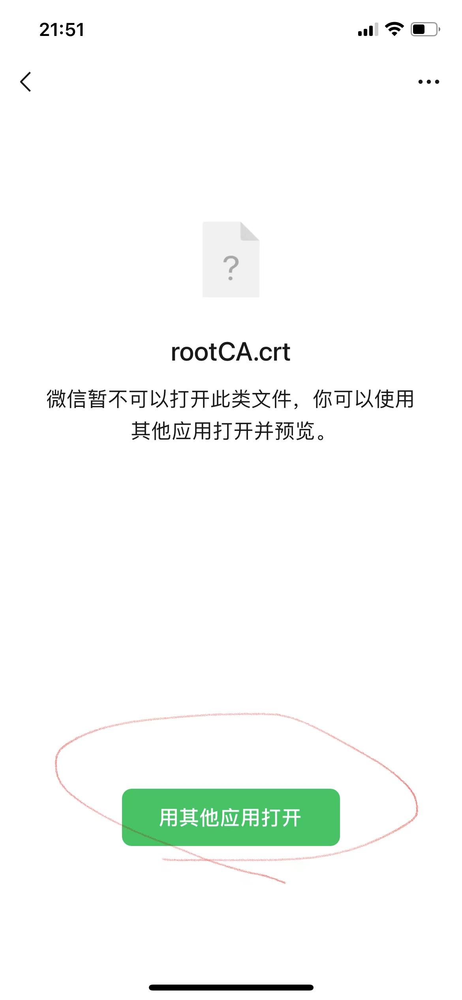

# Mac + Whistle 抓取 IPhone HTTPS 包

[TOC]

## 安装 Whistle

1. 安装 [Whistle](https://wproxy.org/whistle)[ˈwɪsəl] 之前，需要先安装 Node：[Node.js 安装配置](https://www.runoob.com/nodejs/nodejs-install-setup.html)
2. 安装并启动 Whistle：
```shell
npm i -g whistle && w2 start --init
```
3. 一键安装过程中的注意事项：
   - Mac 需要两次输入开机密码或指纹验证  
  


4. 安装成功，访问 http://local.whistlejs.com/ ，可以看到如下界面：  


## 在 IPhone 上安装 CA 证书

1. 点击 HTTPS，下载 CA 证书：  


2. 将 CA 证书发送到 IPhone，可以通过微信文件传输助手发送：  


3. 存储 CA 证书：  
  


4. 找到并打开 CA 证书：  
  
  
  


5. 安装 CA 证书（设置 -> 通用 -> VPN与设备管理）：  
  


6. 信任 CA 证书（设置 -> 通用 -> 关于本机 -> 证书信任设置）：  


## 在 IPhone 上设置代理

1. 设置代理（设置 -> 无线局域网 -> 点击具体的 WiFi）：  


2. 在 PC 端配置要过滤的请求：  


3. 在手机上访问应用，就可以抓到对应的包了：  


## 清理现场

如果抓完包，需要关闭代理，则用以下命令关闭：

```shell
w2 proxy off
w2 stop
```

需要重新启动，则敲一下命令：

```shell
w2 proxy on
w2 start
```