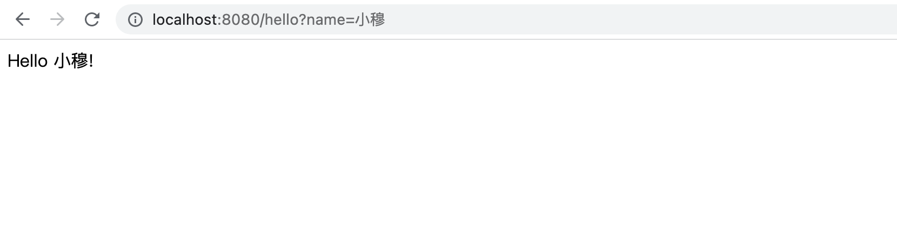

# 从零搭建 Spring MVC 项目 —— HelloWorld

## 1. 继承 Spring Boot 项目

```xml
<parent>
    <groupId>org.springframework.boot</groupId>
    <artifactId>spring-boot-starter-parent</artifactId>
    <version>2.7.2</version>
    <relativePath/>
</parent>
```

## 2. 引入 Spring MVC 依赖

```xml
<dependency>
    <groupId>org.springframework.boot</groupId>
    <artifactId>spring-boot-starter-web</artifactId>
</dependency>
```

## 3. 编写 Controller 代码

```java
@RestController
public class HelloWorldController {

    @GetMapping("/hello")
    public String hello(@RequestParam(value = "name", defaultValue = "World") String name) {
        return String.format("Hello %s!", name);
    }

}
```

## 4. 编写启动类

```java
@SpringBootApplication
public class Application {

    public static void main(String[] args) {
        SpringApplication.run(Application.class, args);
    }

}
```

## 5. 运行启动类

运行启动类，在浏览器中输入：`http://localhost:8080/hello?name=小穆` ，即可看到如下效果：



[返回首页](https://susamlu.github.io/paitse)
[获取源码](https://github.com/susamlu/spring-mvc)