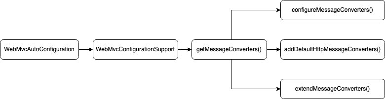

# 从零搭建 Spring MVC 项目 —— HttpMessageConverter

## Long 转 String，日期转时间戳

### 1. 初始代码

```java
@Data
public class UserRequest {

    private Long id;

    private String name;

    private Date createTime;

    private Date updateTime;

}
```

```java
@RestController
public class UserController {

    @PostMapping("/api/users")
    public UserRequest createUser(@RequestBody UserRequest userRequest) {
        userRequest.setId(IdUtil.getSnowflakeNextId());
        return userRequest;
    }

}
```

### 2. 运行结果

使用 curl 访问接口：

```shell
curl --location --request POST 'http://localhost:8080/api/users' \
--header 'Content-Type: application/json' \
--data-raw '{
    "name": "小穆",
    "createTime": 1661004235959,
    "updateTime": 1661004235959
}'
```

返回结果如下：

```json
{
    "id": 1560991269656014848,
    "name": "小穆",
    "createTime": "2022-08-20T14:03:55.959+00:00",
    "updateTime": "2022-08-20T14:03:55.959+00:00"
}
```

目前存在两个问题：

1. 返回的 id 位数过长，前端接收到的结果会发生溢出，后面几位数字会被转成 0；
2. 返回的时间格式对前端不友好，前端同事希望收到的是时间戳。

如何解决？继续往下看。

### 3. 使用 HttpMessageConverter 转换数据

> Long.class 只能转换包装类型 (Long) 的数据，Long.TYPE 只能转换基础类型 (long) 的数据。

```java
@Configuration
public class WebConfiguration implements WebMvcConfigurer {

    @Override
    public void extendMessageConverters(List<HttpMessageConverter<?>> converters) {
        MappingJackson2HttpMessageConverter jackson2HttpMessageConverter = new MappingJackson2HttpMessageConverter();
        converters.add(0, jackson2HttpMessageConverter);

        ObjectMapper objectMapper = jackson2HttpMessageConverter.getObjectMapper();
        SimpleModule simpleModule = new SimpleModule();
        simpleModule.addSerializer(Long.class, ToStringSerializer.instance);
        simpleModule.addSerializer(Long.TYPE, ToStringSerializer.instance);
        simpleModule.addSerializer(Date.class, DateSerializer.instance);
        objectMapper.registerModule(simpleModule);
    }

}
```

### 4. 转换后的运行结果

使用 curl 访问接口：

```shell
curl --location --request POST 'http://localhost:8080/api/users' \
--header 'Content-Type: application/json' \
--data-raw '{
    "name": "小穆",
    "createTime": 1661004235959,
    "updateTime": 1661004235959
}'
```

返回结果如下，上面遇到的问题顺利解决：

```json
{
  "id": "1561221986730184704",
  "name": "小穆",
  "createTime": 1661004235959,
  "updateTime": 1661004235959
}
```

## 进阶学习

### 自定义 Serializer

### HttpMessageConverter 原理

要理解 HttpMessageConverter 是怎么运作的，需要理解它的组装过程和调用过程。

#### 组装过程

核心的代码流程如下图：



下面结合源代码，讲讲具体的加载过程。实际的过程比较繁琐，需要耐心阅读。建议结合源代码阅读，必要时进行本地调试，如此可以更好地理解整个流程。

在 Spring Boot 项目中，会自动加载 WebMvcAutoConfiguration。

```java
@AutoConfigureOrder(Ordered.HIGHEST_PRECEDENCE + 10)
public class WebMvcAutoConfiguration {
    // ...
}
```

加载 WebMvcAutoConfiguration 的时候，它的内部类 EnableWebMvcConfiguration 也会被加载。

```java
/**
 * Configuration equivalent to {@code @EnableWebMvc}.
 */
@Configuration(proxyBeanMethods = false)
@EnableConfigurationProperties(WebProperties.class)
public static class EnableWebMvcConfiguration extends DelegatingWebMvcConfiguration implements ResourceLoaderAware {
    // ...
}
```

EnableWebMvcConfiguration 加载，会触发父类 DelegatingWebMvcConfiguration 的加载。
DelegatingWebMvcConfiguration 加载的时候，会把项目中所有的 WebMvcConfigurer 对象收集起来。

```java
@Configuration(proxyBeanMethods = false)
public class DelegatingWebMvcConfiguration extends WebMvcConfigurationSupport {
    
    @Autowired(required = false)
    public void setConfigurers(List<WebMvcConfigurer> configurers) {
        if (!CollectionUtils.isEmpty(configurers)) {
            this.configurers.addWebMvcConfigurers(configurers);
        }
    }
    
    // ...

}
```

并且也会触发父类 WebMvcConfigurationSupport 的加载。
WebMvcConfigurationSupport 的加载，又触发了 requestMappingHandlerAdapter() 方法的执行。
requestMappingHandlerAdapter() 方法会调用 getMessageConverters() 方法。

```java
public class WebMvcConfigurationSupport implements ApplicationContextAware, ServletContextAware {

    // ...
    
    @Bean
    public RequestMappingHandlerAdapter requestMappingHandlerAdapter(/* ... */){
        // ...
        adapter.setMessageConverters(getMessageConverters());
        // ...
    }

    // ...
    
}
```

getMessageConverters() 是这里面的核心方法。

```java
public class WebMvcConfigurationSupport implements ApplicationContextAware, ServletContextAware {

    // ...

    protected final List<HttpMessageConverter<?>> getMessageConverters() {
        if (this.messageConverters == null) {
            this.messageConverters = new ArrayList<>();
            configureMessageConverters(this.messageConverters);
            if (this.messageConverters.isEmpty()) {
                addDefaultHttpMessageConverters(this.messageConverters);
            }
            extendMessageConverters(this.messageConverters);
        }
        return this.messageConverters;
    }

    // ...
    
}
```

getMessageConverters() 先调用 configureMessageConverters()。如果调用完之后，messageConverters 依然为空，
就调用 addDefaultHttpMessageConverters()。最后再调用 extendMessageConverters()。

调用 addDefaultHttpMessageConverters() 的时候，又会触发 HttpMessageConvertersAutoConfiguration 的加载。
HttpMessageConvertersAutoConfiguration 会按具体情况选择性添加额外的 HttpMessageConverter。

```java
@ConditionalOnClass(HttpMessageConverter.class)
public class HttpMessageConvertersAutoConfiguration {
    // ...
}
```

如果有多个 WebMvcConfigurer，它们的方法会被依次执行。

```java
class WebMvcConfigurerComposite implements WebMvcConfigurer {
    
    // ...
    
    @Override
    public void configureMessageConverters(List<HttpMessageConverter<?>> converters) {
        for (WebMvcConfigurer delegate : this.delegates) {
            delegate.configureMessageConverters(converters);
        }
    }

    @Override
    public void extendMessageConverters(List<HttpMessageConverter<?>> converters) {
        for (WebMvcConfigurer delegate : this.delegates) {
            delegate.extendMessageConverters(converters);
        }
    }

    // ...
    
}
```

上述所有代码执行完，就可以顺利得到所有的 HttpMessageConverter 了。

#### 调用过程

#### 思考题：

1. 使用 configureHandlerExceptionResolvers，还是 extendHandlerExceptionResolvers？
2. converters.add(jackson2HttpMessageConverter) 与 converters.add(0, jackson2HttpMessageConverter) 有何区别？

## 扩展学习

EnableWebMvc, WebMvcAutoConfiguration, WebMvcConfigurationSupport, WebMvcConfigurer, WebMvcConfigurerAdapter