# 从零搭建 Spring MVC 项目 —— HttpMessageConverter

## Long 转 String，日期转时间戳

从下面的例子中，可以了解到在什么情况下我们需要进行参数类型的转换，以及如何转换。

### 1. 初始代码

```java
@Data
public class UserRequest {

    private Long id;

    private String name;

    private Date createTime;

    private Date updateTime;

}
```

```java
@RestController
public class UserController {

    @PostMapping("/api/users")
    public UserRequest createUser(@RequestBody UserRequest userRequest) {
        userRequest.setId(IdUtil.getSnowflakeNextId());
        return userRequest;
    }

}
```

### 2. 运行结果

使用 curl 访问接口：

```shell
curl --location --request POST 'http://localhost:8080/api/users' \
--header 'Content-Type: application/json' \
--data-raw '{
    "name": "小穆",
    "createTime": 1661004235959,
    "updateTime": 1661004235959
}'
```

返回结果如下：

```json
{
    "id": 1560991269656014848,
    "name": "小穆",
    "createTime": "2022-08-20T14:03:55.959+00:00",
    "updateTime": "2022-08-20T14:03:55.959+00:00"
}
```

目前存在两个问题：

1. 返回的 id 位数过长，前端接收到的结果会发生溢出，后面几位数字会被转成 0；
2. 返回的时间格式对前端不友好，前端同事更希望收到的是时间戳。

这个问题要如何解决？我们继续往下看。

### 3. 使用 HttpMessageConverter 转换数据

> Long.class 只能转换包装类型 (Long) 的数据，Long.TYPE 只能转换基础类型 (long) 的数据。

```java
@Configuration
public class WebConfiguration implements WebMvcConfigurer {

    @Override
    public void extendMessageConverters(List<HttpMessageConverter<?>> converters) {
        MappingJackson2HttpMessageConverter jackson2HttpMessageConverter = new MappingJackson2HttpMessageConverter();
        converters.add(0, jackson2HttpMessageConverter);

        ObjectMapper objectMapper = jackson2HttpMessageConverter.getObjectMapper();
        SimpleModule simpleModule = new SimpleModule();
        simpleModule.addSerializer(Long.class, ToStringSerializer.instance);
        simpleModule.addSerializer(Long.TYPE, ToStringSerializer.instance);
        simpleModule.addSerializer(Date.class, DateSerializer.instance);
        objectMapper.registerModule(simpleModule);
    }

}
```

### 4. 转换后的运行结果

使用 curl 访问接口：

```shell
curl --location --request POST 'http://localhost:8080/api/users' \
--header 'Content-Type: application/json' \
--data-raw '{
    "name": "小穆",
    "createTime": 1661004235959,
    "updateTime": 1661004235959
}'
```

返回结果如下，上面遇到的问题顺利解决：

```json
{
  "id": "1561221986730184704",
  "name": "小穆",
  "createTime": 1661004235959,
  "updateTime": 1661004235959
}
```

## 进阶学习

### HttpMessageConverter 原理

要理解 HttpMessageConverter 是怎么运作的，需要理解它的加载过程和调用过程。

#### 加载过程

核心的代码流程如下图：



下面结合源代码，讲讲具体的加载过程。实际的过程比较繁琐，需要耐心阅读。建议结合源代码阅读，必要时进行本地调试，如此可以更好地理解整个流程。

在 Spring Boot 项目中，会自动加载 WebMvcAutoConfiguration。

```java
@AutoConfigureOrder(Ordered.HIGHEST_PRECEDENCE + 10)
public class WebMvcAutoConfiguration {
    // ...
}
```

加载 WebMvcAutoConfiguration 的时候，它的内部类 EnableWebMvcConfiguration 也会被加载。

```java
/**
 * Configuration equivalent to {@code @EnableWebMvc}.
 */
@Configuration(proxyBeanMethods = false)
@EnableConfigurationProperties(WebProperties.class)
public static class EnableWebMvcConfiguration extends DelegatingWebMvcConfiguration implements ResourceLoaderAware {
    // ...
}
```

EnableWebMvcConfiguration 的加载，会触发父类 DelegatingWebMvcConfiguration 的加载。
DelegatingWebMvcConfiguration 加载的时候，会把项目中所有的 WebMvcConfigurer 对象收集起来。

```java
@Configuration(proxyBeanMethods = false)
public class DelegatingWebMvcConfiguration extends WebMvcConfigurationSupport {

    private final WebMvcConfigurerComposite configurers = new WebMvcConfigurerComposite();

    @Autowired(required = false)
    public void setConfigurers(List<WebMvcConfigurer> configurers) {
        if (!CollectionUtils.isEmpty(configurers)) {
            this.configurers.addWebMvcConfigurers(configurers);
        }
    }

    // ...

}
```

并且也会触发父类 WebMvcConfigurationSupport 的加载。
WebMvcConfigurationSupport 的加载，又触发了 requestMappingHandlerAdapter() 方法的执行。
requestMappingHandlerAdapter() 方法会调用 getMessageConverters() 方法。

```java
public class WebMvcConfigurationSupport implements ApplicationContextAware, ServletContextAware {

    // ...

    @Bean
    public RequestMappingHandlerAdapter requestMappingHandlerAdapter(/* ... */) {
        // ...
        adapter.setMessageConverters(getMessageConverters());
        // ...
    }

    // ...

}
```

getMessageConverters() 是这里面的核心方法。

```java
public class WebMvcConfigurationSupport implements ApplicationContextAware, ServletContextAware {

    // ...

    protected final List<HttpMessageConverter<?>> getMessageConverters() {
        if (this.messageConverters == null) {
            this.messageConverters = new ArrayList<>();
            configureMessageConverters(this.messageConverters);
            if (this.messageConverters.isEmpty()) {
                addDefaultHttpMessageConverters(this.messageConverters);
            }
            extendMessageConverters(this.messageConverters);
        }
        return this.messageConverters;
    }

    // ...

}
```

getMessageConverters() 先调用 configureMessageConverters()。如果调用完之后，messageConverters 依然为空，
就调用 addDefaultHttpMessageConverters()。最后再调用 extendMessageConverters()。

调用 addDefaultHttpMessageConverters() 的时候，又会触发 HttpMessageConvertersAutoConfiguration 的加载。
HttpMessageConvertersAutoConfiguration 会按具体情况选择性添加额外的 HttpMessageConverter。

```java
@ConditionalOnClass(HttpMessageConverter.class)
public class HttpMessageConvertersAutoConfiguration {
    // ...
}
```

如果有多个 WebMvcConfigurer，它们的方法会被依次执行。

```java
class WebMvcConfigurerComposite implements WebMvcConfigurer {

    // ...

    @Override
    public void configureMessageConverters(List<HttpMessageConverter<?>> converters) {
        for (WebMvcConfigurer delegate : this.delegates) {
            delegate.configureMessageConverters(converters);
        }
    }

    @Override
    public void extendMessageConverters(List<HttpMessageConverter<?>> converters) {
        for (WebMvcConfigurer delegate : this.delegates) {
            delegate.extendMessageConverters(converters);
        }
    }

    // ...

}
```

上述所有代码执行完，就可以顺利得到所有的 HttpMessageConverter 了。

#### 调用过程

核心的代码流程如下图：


实际的调用流程会非常复杂，下面选取其中较为核心的代码进行讲解。

DispatcherServlet 在执行 doDispatch() 的时候，最终会调用到 RequestMappingHandlerAdapter 类的 invokeHandlerMethod() 方法。
上文笔者已经提到，RequestMappingHandlerAdapter 通过调用 WebMvcConfigurationSupport 的 getMessageConverters() 方法，将 HttpMessageConverter 收集了起来。
RequestMappingHandlerAdapter 在加载的时候，其实也会将 HttpMessageConverter 设置到 HandlerMethodArgumentResolverComposite 和 HandlerMethodReturnValueHandlerComposite 中。

```java
public class RequestMappingHandlerAdapter extends AbstractHandlerMethodAdapter
        implements BeanFactoryAware, InitializingBean {
    
    // ...

    @Nullable
    private HandlerMethodArgumentResolverComposite argumentResolvers;
    // ...
    @Nullable
    private HandlerMethodReturnValueHandlerComposite returnValueHandlers;
    
    // ...

    @Override
    public void afterPropertiesSet() {
        // ...
        if (this.argumentResolvers == null) {
            List<HandlerMethodArgumentResolver> resolvers = getDefaultArgumentResolvers();
            this.argumentResolvers = new HandlerMethodArgumentResolverComposite().addResolvers(resolvers);
        }
        // ...
        if (this.returnValueHandlers == null) {
            List<HandlerMethodReturnValueHandler> handlers = getDefaultReturnValueHandlers();
            this.returnValueHandlers = new HandlerMethodReturnValueHandlerComposite().addHandlers(handlers);
        }
    }
    
    // ...

    private List<HandlerMethodArgumentResolver> getDefaultArgumentResolvers() {
        // ...
        resolvers.add(new RequestResponseBodyMethodProcessor(getMessageConverters(), this.requestResponseBodyAdvice));
        // ...
        return resolvers;
    }
    
    // ...
    
}
```

最终程序会通过 HandlerMethodArgumentResolverComposite 调用到 AbstractMessageConverterMethodArgumentResolver 的 readWithMessageConverters() 方法，
并在获取到参数后调用 Controller 的接口方法进行业务处理，得到接口方法的返回参数后，
又会调用AbstractMessageConverterMethodProcessor 的 writeWithMessageConverters() 方法 ，将参数通过 Response 报文输出到浏览器中。

AbstractMessageConverterMethodArgumentResolver 会遍历所有 HttpMessageConverter，通过 HttpMessageConverter 的 canRead() 方法找到合适的 HttpMessageConverter，
并调用它的 read() 方法对参数进行解析。
如果找到了 HttpMessageConverter，并解析完成就会马上返回，也就是只有第一个合适的 HttpMessageConverter 的 read() 方法会被执行。
如果找不到 HttpMessageConverter，则抛出 HttpMediaTypeNotSupportedException 异常。

```java
public abstract class AbstractMessageConverterMethodArgumentResolver implements HandlerMethodArgumentResolver {
    
    // ...

    @Nullable
    protected <T> Object readWithMessageConverters(HttpInputMessage inputMessage,
                                                   MethodParameter parameter,
                                                   Type targetType) 
            throws IOException, HttpMediaTypeNotSupportedException, HttpMessageNotReadableException {
        // ...
        for (HttpMessageConverter<?> converter : this.messageConverters) {
            // ...
            if (genericConverter != null ? genericConverter.canRead(targetType, contextClass, contentType) :
                    (targetClass != null && converter.canRead(targetClass, contentType))) {
                // ...
                body = (genericConverter != null ? genericConverter.read(targetType, contextClass, msgToUse) :
                        ((HttpMessageConverter<T>) converter).read(targetClass, msgToUse));
                // ...
                break;
            }
            // ...
            if (body == NO_VALUE) {
                // ...
                throw new HttpMediaTypeNotSupportedException(contentType,
                        getSupportedMediaTypes(targetClass != null ? targetClass : Object.class));
            }
            // ...
        }
        // ...
    }
    
    // ...
    
}
```

类似的，AbstractMessageConverterMethodProcessor 会遍历所有 HttpMessageConverter，通过 HttpMessageConverter 的 canWrite() 方法找到合适的 HttpMessageConverter，
并调用它的 write() 方法将返回参数写到 HTPP 返回报文当中。
如果找到了 HttpMessageConverter，并解析完成就会马上返回，也就是只有第一个合适的 HttpMessageConverter 的 write() 方法会被执行。
如果找不到 HttpMessageConverter，则抛出 HttpMessageNotWritableException 或 HttpMediaTypeNotAcceptableException 异常。

```java
public abstract class AbstractMessageConverterMethodProcessor extends AbstractMessageConverterMethodArgumentResolver
        implements HandlerMethodReturnValueHandler {

    // ...

    protected <T> void writeWithMessageConverters(@Nullable T value, 
                                                  MethodParameter returnType,
                                                  ServletServerHttpRequest inputMessage, 
                                                  ServletServerHttpResponse outputMessage)
            throws IOException, HttpMediaTypeNotAcceptableException, HttpMessageNotWritableException {
        // ...
        for (HttpMessageConverter<?> converter : this.messageConverters) {
            // ...
            if (genericConverter != null ?
                    ((GenericHttpMessageConverter) converter).canWrite(targetType, valueType, selectedMediaType) :
                    converter.canWrite(valueType, selectedMediaType)) {
                // ...
                genericConverter.write(body, targetType, selectedMediaType, outputMessage);
                // ...
                return;
            }
        }
        // ...
        if (body != null) {
            Set<MediaType> producibleMediaTypes =
                    (Set<MediaType>) inputMessage.getServletRequest()
                            .getAttribute(HandlerMapping.PRODUCIBLE_MEDIA_TYPES_ATTRIBUTE);

            if (isContentTypePreset || !CollectionUtils.isEmpty(producibleMediaTypes)) {
                throw new HttpMessageNotWritableException(
                        "No converter for [" + valueType + "] with preset Content-Type '" + contentType + "'");
            }
            throw new HttpMediaTypeNotAcceptableException(getSupportedMediaTypes(body.getClass()));
        }
    }
    
    // ...
    
}
```

#### 思考题：

1. 重写 configureHandlerExceptionResolvers()，还是 extendHandlerExceptionResolvers()？
2. converters.add(jackson2HttpMessageConverter) 与 converters.add(0, jackson2HttpMessageConverter) 有何区别？
3. WebMvcConfigurer、WebMvcConfigurerAdapter、WebMvcConfigurationSupport 到底使用哪一个？@EnableWebMvc 在什么时候需要，什么时候不需要？