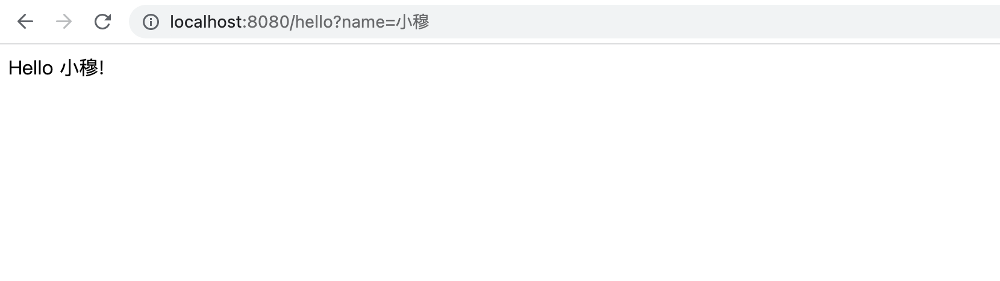

# Spring Web 开发：从入门到精通 —— HelloWorld

[TOC]

本系列文章将从一个简单的 HelloWorld 项目开始，讲述如何一步步搭建企业级的 Spring Web 项目。在这个过程中，笔者将从企业级项目开发的实际需要出发，系统讲述其中涉及的基础知识，并通过跟读 Spring 源码的方式，带领读者深入了解其中的实现细节。

版本说明：
- 所有的项目代码均构建在 Spring Boot 2.7.2 之上。

学习前提：
- 文章中涉及到的代码主要构建在 Java 语言之上，因此阅读之前掌握基本的 Java 语言基础是必须的；
- 项目代码以 Maven 作为项目管理工具，开始之前你应当对 Maven 的基础知识有所了解。

## Maven 项目

### 项目结构

开始之前，我们先复习一下 Maven 项目的基本内容，它的目录结构如下：

```html
.
├── pom.xml
└── src
    ├── main
    │   ├── java
    │   └── resources
    └── test
        ├── java
        └── resources
```

pom.xml 文件主要用于定义项目的依赖，main 目录主要用于存放项目的代码和配置，test 目录主要用于存放测试的代码和配置。

### pom.xml

下面是一个简单的 pom.xml 文件：

```xml
<project xmlns="http://maven.apache.org/POM/4.0.0" xmlns:xsi="http://www.w3.org/2001/XMLSchema-instance"
         xsi:schemaLocation="http://maven.apache.org/POM/4.0.0 http://maven.apache.org/xsd/maven-4.0.0.xsd">
    <modelVersion>4.0.0</modelVersion>

    <groupId>com.mycompany.app</groupId>
    <artifactId>my-app</artifactId>
    <version>1.0-SNAPSHOT</version>

    <name>my-app</name>
    <url>http://www.example.com</url>

</project>
```

modelVersion 指定 pom 文件符合哪个版本的描述符，groupId、artifactId、version 用来共同标识一个唯一的 jar 包，name 和 url 为描述性内容。

## 快速开始

搭建一个 Spring Web 项目，只需要简单的几步：

### 1. 继承 Spring Boot 项目

`spring-boot-starter-parent` 在 pom 文件中预定义了各组件的依赖版本，继承了该项目，我们在引入 Spring Web 组件的时候，就不再需要去指定它的版本。

```xml
<parent>
    <groupId>org.springframework.boot</groupId>
    <artifactId>spring-boot-starter-parent</artifactId>
    <version>2.7.2</version>
    <relativePath/>
</parent>
```

### 2. 引入 Spring Web 依赖

`spring-boot-starter-web` 定义了 Spring Web 项目所需要的全部依赖。因此，我们在引入 Spring Web 依赖的时候，只需要简单的声明：

```xml
<dependency>
    <groupId>org.springframework.boot</groupId>
    <artifactId>spring-boot-starter-web</artifactId>
</dependency>
```

最终的 `pom.xml` 文件内容如下：

```xml
<?xml version="1.0" encoding="UTF-8"?>
<project xmlns="http://maven.apache.org/POM/4.0.0" xmlns:xsi="http://www.w3.org/2001/XMLSchema-instance"
         xsi:schemaLocation="http://maven.apache.org/POM/4.0.0 https://maven.apache.org/xsd/maven-4.0.0.xsd">
    <modelVersion>4.0.0</modelVersion>

    <parent>
        <groupId>org.springframework.boot</groupId>
        <artifactId>spring-boot-starter-parent</artifactId>
        <version>2.7.2</version>
        <relativePath/>
    </parent>

    <groupId>org.susamlu.springweb</groupId>
    <artifactId>spring-web-helloworld</artifactId>
    <version>1.0.0-SNAPSHOT</version>
    <packaging>jar</packaging>

    <name>spring-web-helloworld</name>
    <description>Demo project for Spring Web</description>

    <dependencies>
        <dependency>
            <groupId>org.springframework.boot</groupId>
            <artifactId>spring-boot-starter-web</artifactId>
        </dependency>
    </dependencies>

</project>
```

### 3. 编写 Controller 代码

通过 @RestController 声明接口类，由此，我们可以在该类中定义 RESTful 风格的接口方法。使用 @GetMapping 指定接口的路径，使用 @RequestParam 指定接口接收的请求参数。

```java
package org.susamlu.springweb.controller;

import org.springframework.web.bind.annotation.GetMapping;
import org.springframework.web.bind.annotation.RequestParam;
import org.springframework.web.bind.annotation.RestController;

@RestController
public class HelloWorldController {

    @GetMapping("/hello")
    public String hello(@RequestParam(value = "name", defaultValue = "World") String name) {
        return String.format("Hello %s!", name);
    }

}
```

### 4. 编写启动类

使用 @SpringBootApplication 指定项目的启动类，在 main() 方法中执行 SpringApplication.run() 方法，至此，HelloWorld 项目的代码就全部编写完了。

```java
package org.susamlu.springweb;

import org.springframework.boot.SpringApplication;
import org.springframework.boot.autoconfigure.SpringBootApplication;

@SpringBootApplication
public class HelloWorldApplication {

    public static void main(String[] args) {
        SpringApplication.run(HelloWorldApplication.class, args);
    }

}
```

### 5. 运行启动类

运行启动类，在浏览器中输入：`http://localhost:8080/hello?name=小穆` ，即可看到如下效果：



[返回首页](https://susamlu.github.io/paitse)
[获取源码](https://github.com/susamlu/spring-web)