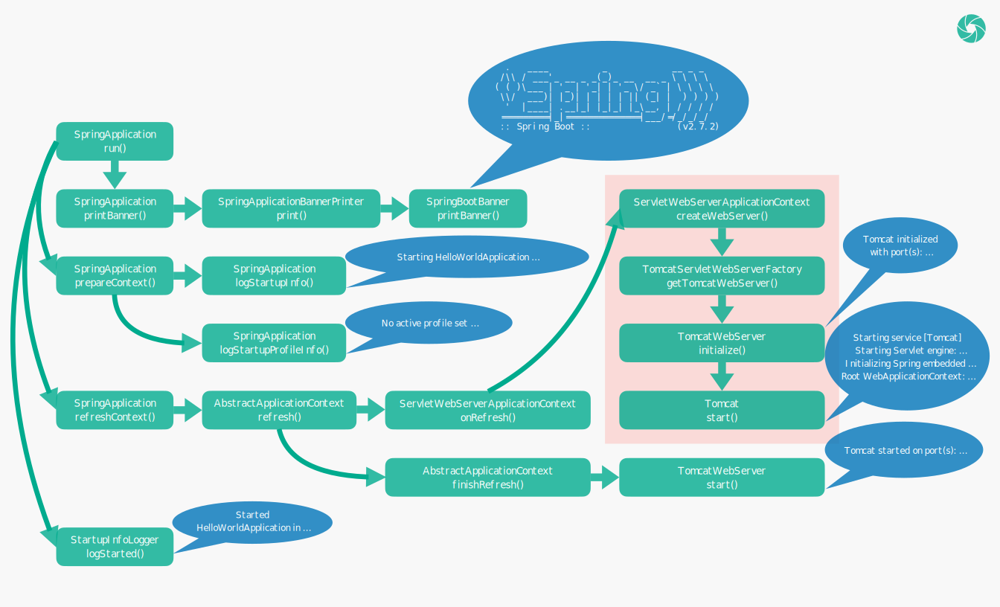

# 从零学习 Spring Web 开发 —— HelloWorld (进阶篇)

上一篇文章已经介绍了如何快速搭建一个 Spring Web 项目，本文将对上文中提及的几个技术点，进行深入的讲解。

我们前面提到，搭建 Spring Web 项目时，只需要继承 `spring-boot-starter-parent` ，并引入 `spring-boot-starter-web` ，即可把 Spring Web 项目所需要的全部依赖引进来，并且我们不需要指定依赖的版本，这是如何做到的呢？

这里会涉及到 Maven 的 parent 和 dependencyManagement 标签，我们先讲讲这两个标签的作用。

## Maven 标签

### parent

在 Maven 项目中，可以通过继承的方式，让子项目继承父项目所定义的内容，如：groupId、version、properties、dependencies 等。

下面的例子中，`my-app-child` 只需要继承 `my-app-parent` ，即可引入父项目的全部依赖。即父项目 `my-app-parent` 引入了 `maven-artifact` 和 `maven-core` 两个依赖，并指定了它们的版本，子项目只需继承 `my-app-parent` ，就引入了这两个依赖，并且依赖的版本也跟父项目所指定的版本一样。

```xml
<!-- my-app-parent -->
<project xmlns="http://maven.apache.org/POM/4.0.0" xmlns:xsi="http://www.w3.org/2001/XMLSchema-instance"
         xsi:schemaLocation="http://maven.apache.org/POM/4.0.0 http://maven.apache.org/xsd/maven-4.0.0.xsd">
    <modelVersion>4.0.0</modelVersion>

    <groupId>com.mycompany.app</groupId>
    <artifactId>my-app-parent</artifactId>
    <version>1.0-SNAPSHOT</version>

    <name>my-app-parent</name>
    <url>http://www.example.com</url>

    <properties>
        <mavenVersion>3.0</mavenVersion>
    </properties>

    <dependencies>
        <dependency>
            <groupId>org.apache.maven</groupId>
            <artifactId>maven-artifact</artifactId>
            <version>${mavenVersion}</version>
        </dependency>
        <dependency>
            <groupId>org.apache.maven</groupId>
            <artifactId>maven-core</artifactId>
            <version>${mavenVersion}</version>
        </dependency>
    </dependencies>

</project>
```

```xml
<!-- my-app-child -->
<project xmlns="http://maven.apache.org/POM/4.0.0" xmlns:xsi="http://www.w3.org/2001/XMLSchema-instance"
         xsi:schemaLocation="http://maven.apache.org/POM/4.0.0 http://maven.apache.org/xsd/maven-4.0.0.xsd">
    <modelVersion>4.0.0</modelVersion>

    <parent>
        <groupId>com.mycompany.app</groupId>
        <artifactId>my-app-parent</artifactId>
        <version>1.0-SNAPSHOT</version>
    </parent>

    <artifactId>my-app-child</artifactId>

</project>
```

### dependencyManagement

有时候子项目并不需要引入父项目的全部依赖，只需要引入部分依赖，但又希望在父项目中统一定义依赖的版本，`dependencyManagement` 标签可以帮我们完成这个事情。

下面的例子中，`my-app-child` 引入了 `maven-core` 依赖，父项目仅仅只是预定义了依赖的版本。也就是说，父项目指定了 `maven-artifact` 和 `maven-core` 两个依赖的版本，但并没有引入依赖，在子项目中只引入了 `maven-core` 依赖，即 `maven-artifact` 是没有被引入的，且子项目无需指定 `maven-core` 依赖的版本，该依赖的版本就与父项目所指定的版本一样。

```xml
<!-- my-app-parent -->
<project xmlns="http://maven.apache.org/POM/4.0.0" xmlns:xsi="http://www.w3.org/2001/XMLSchema-instance"
         xsi:schemaLocation="http://maven.apache.org/POM/4.0.0 http://maven.apache.org/xsd/maven-4.0.0.xsd">
    <modelVersion>4.0.0</modelVersion>

    <groupId>com.mycompany.app</groupId>
    <artifactId>my-app-parent</artifactId>
    <version>1.0-SNAPSHOT</version>

    <name>my-app-parent</name>
    <url>http://www.example.com</url>

    <properties>
        <mavenVersion>3.0</mavenVersion>
    </properties>

    <dependencyManagement>
        <dependencies>
            <dependency>
                <groupId>org.apache.maven</groupId>
                <artifactId>maven-artifact</artifactId>
                <version>${mavenVersion}</version>
            </dependency>
            <dependency>
                <groupId>org.apache.maven</groupId>
                <artifactId>maven-core</artifactId>
                <version>${mavenVersion}</version>
            </dependency>
        </dependencies>
    </dependencyManagement>

</project>
```

```xml
<!-- my-app-child -->
<project xmlns="http://maven.apache.org/POM/4.0.0" xmlns:xsi="http://www.w3.org/2001/XMLSchema-instance"
         xsi:schemaLocation="http://maven.apache.org/POM/4.0.0 http://maven.apache.org/xsd/maven-4.0.0.xsd">
    <modelVersion>4.0.0</modelVersion>

    <parent>
        <groupId>com.mycompany.app</groupId>
        <artifactId>my-app-parent</artifactId>
        <version>1.0-SNAPSHOT</version>
    </parent>

    <artifactId>my-app-child</artifactId>

    <dependencies>
        <dependency>
            <groupId>org.apache.maven</groupId>
            <artifactId>maven-core</artifactId>
        </dependency>
    </dependencies>

</project>
```

## spring-boot-starter-parent

`spring-boot-starter-parent` 继承自父项目 `spring-boot-dependencies`，`spring-boot-dependencies` 通过 dependencyManagement 标签预先指定了 Spring Boot 项目的全部依赖版本。尤其是，将 `spring-boot-starter-web` 的版本指定为 2.7.2 。

```xml
<!-- spring-boot-starter-parent -->
<project xmlns="http://maven.apache.org/POM/4.0.0"
         xsi:schemaLocation="http://maven.apache.org/POM/4.0.0 http://maven.apache.org/xsd/maven-4.0.0.xsd"
         xmlns:xsi="http://www.w3.org/2001/XMLSchema-instance">
    <modelVersion>4.0.0</modelVersion>
    <parent>
        <groupId>org.springframework.boot</groupId>
        <artifactId>spring-boot-dependencies</artifactId>
        <version>2.7.2</version>
    </parent>
    <!-- ... -->
</project>
```

```xml
<!-- spring-boot-dependencies -->
<project xmlns="http://maven.apache.org/POM/4.0.0"
         xsi:schemaLocation="http://maven.apache.org/POM/4.0.0 http://maven.apache.org/xsd/maven-4.0.0.xsd"
         xmlns:xsi="http://www.w3.org/2001/XMLSchema-instance">
    <modelVersion>4.0.0</modelVersion>
    <groupId>org.springframework.boot</groupId>
    <artifactId>spring-boot-dependencies</artifactId>
    <version>2.7.2</version>
    <packaging>pom</packaging>
    <name>spring-boot-dependencies</name>
    <!-- ... -->
    <dependencyManagement>
        <dependencies>
            <!-- ... -->
            <dependency>
                <groupId>org.springframework.boot</groupId>
                <artifactId>spring-boot-starter-web</artifactId>
                <version>2.7.2</version>
            </dependency>
            <!-- ... -->
        </dependencies>
    </dependencyManagement>
    <!-- ... -->
</project>
```

## spring-boot-starter-web

2.7.2 版本的 `spring-boot-starter-web` 将 `spring-web` 等项目引入了进来，并指定了各依赖的版本：

```xml
<!-- spring-boot-starter-web -->
<project xsi:schemaLocation="http://maven.apache.org/POM/4.0.0 http://maven.apache.org/xsd/maven-4.0.0.xsd"
         xmlns="http://maven.apache.org/POM/4.0.0"
         xmlns:xsi="http://www.w3.org/2001/XMLSchema-instance">
    <modelVersion>4.0.0</modelVersion>
    <groupId>org.springframework.boot</groupId>
    <artifactId>spring-boot-starter-web</artifactId>
    <version>2.7.2</version>
    <name>spring-boot-starter-web</name>
    <!-- ... -->
    <dependencies>
        <dependency>
            <groupId>org.springframework.boot</groupId>
            <artifactId>spring-boot-starter</artifactId>
            <version>2.7.2</version>
            <scope>compile</scope>
        </dependency>
        <dependency>
            <groupId>org.springframework.boot</groupId>
            <artifactId>spring-boot-starter-json</artifactId>
            <version>2.7.2</version>
            <scope>compile</scope>
        </dependency>
        <dependency>
            <groupId>org.springframework.boot</groupId>
            <artifactId>spring-boot-starter-tomcat</artifactId>
            <version>2.7.2</version>
            <scope>compile</scope>
        </dependency>
        <dependency>
            <groupId>org.springframework</groupId>
            <artifactId>spring-web</artifactId>
            <version>5.3.22</version>
            <scope>compile</scope>
        </dependency>
        <dependency>
            <groupId>org.springframework</groupId>
            <artifactId>spring-webmvc</artifactId>
            <version>5.3.22</version>
            <scope>compile</scope>
        </dependency>
    </dependencies>
</project>
```

在 `spring-boot-starter-parent` 和 `spring-boot-starter-web` 的共同作用下，就完成了 Spring Web 项目全部依赖和依赖版本的声明。

## @SpringBootApplication 与 SpringApplication

不知道读者在编写 Spring Boot 项目的时候，有没有思考过启动类中为何需要同时使用 @SpringBootApplication 和 SpringApplication，它们分别的作用又是什么？下面让我们一起来一探究竟。

### @SpringBootApplication

@SpringBootApplication 引入了 @SpringBootConfiguration、@EnableAutoConfiguration、@ComponentScan 三个注解：

```java
@SpringBootConfiguration
@EnableAutoConfiguration
@ComponentScan(excludeFilters = { @Filter(type = FilterType.CUSTOM, classes = TypeExcludeFilter.class),
		@Filter(type = FilterType.CUSTOM, classes = AutoConfigurationExcludeFilter.class) })
public @interface SpringBootApplication {
    // ...
}
```

其中 @SpringBootConfiguration 又引入了 @Configuration，从而可以在启动类中通过 @Bean 配置容器 Bean。

```java
@Configuration
@Indexed
public @interface SpringBootConfiguration {
    // ...
}
```

@EnableAutoConfiguration 通过 @Import 引入了 AutoConfigurationImportSelector 类，又通过 @AutoConfigurationPackage 间接地引入了 AutoConfigurationPackages.Registrar 类。

```java
@AutoConfigurationPackage
@Import(AutoConfigurationImportSelector.class)
public @interface EnableAutoConfiguration {
    // ...
}
```

```java
@Import(AutoConfigurationPackages.Registrar.class)
public @interface AutoConfigurationPackage {
    // ...
}
```

总的来说，就是 @SpringBootApplication 通过 @Configuration 注解让启动类 HelloWorldApplication 成为了配置类，通过 @EnableAutoConfiguration 开启了自动配置的扫描，通过 @ComponentScan 开启了 Spring Bean 的自动扫描。

### SpringApplication

SpringApplication.run() 是整个 Spring Boot 应用的入口。核心的启动流程如下：


### 启动日志

为了让读者对 Spring Boot 应用的启动过程有更清晰的理解，笔者将结合项目的启动日志，对项目启动后的调用流程做个大致的分析。下面是项目的一次启动日志：

```html

  .   ____          _            __ _ _
 /\\ / ___'_ __ _ _(_)_ __  __ _ \ \ \ \
( ( )\___ | '_ | '_| | '_ \/ _` | \ \ \ \
 \\/  ___)| |_)| | | | | || (_| |  ) ) ) )
  '  |____| .__|_| |_|_| |_\__, | / / / /
 =========|_|==============|___/=/_/_/_/
 :: Spring Boot ::                (v2.7.2)

2022-09-08 08:28:22.964  INFO 54995 --- [           main] o.s.springweb.HelloWorldApplication      : Starting HelloWorldApplication using Java 11.0.12 on luxiaocongdeMac-2.local with PID 54995 (/Users/xiaoconglu/code/java/spring-web/spring-web-helloworld/target/classes started by xiaoconglu in /Users/xiaoconglu/code/java/spring-web)
2022-09-08 08:28:22.968  INFO 54995 --- [           main] o.s.springweb.HelloWorldApplication      : No active profile set, falling back to 1 default profile: "default"
2022-09-08 08:28:24.900  INFO 54995 --- [           main] o.s.b.w.embedded.tomcat.TomcatWebServer  : Tomcat initialized with port(s): 8080 (http)
2022-09-08 08:28:24.912  INFO 54995 --- [           main] o.apache.catalina.core.StandardService   : Starting service [Tomcat]
2022-09-08 08:28:24.913  INFO 54995 --- [           main] org.apache.catalina.core.StandardEngine  : Starting Servlet engine: [Apache Tomcat/9.0.65]
2022-09-08 08:28:25.090  INFO 54995 --- [           main] o.a.c.c.C.[Tomcat].[localhost].[/]       : Initializing Spring embedded WebApplicationContext
2022-09-08 08:28:25.091  INFO 54995 --- [           main] w.s.c.ServletWebServerApplicationContext : Root WebApplicationContext: initialization completed in 1910 ms
2022-09-08 08:28:25.857  INFO 54995 --- [           main] o.s.b.w.embedded.tomcat.TomcatWebServer  : Tomcat started on port(s): 8080 (http) with context path ''
2022-09-08 08:28:25.873  INFO 54995 --- [           main] o.s.springweb.HelloWorldApplication      : Started HelloWorldApplication in 3.735 seconds (JVM running for 4.41)
```

SpringApplication 的静态 run() 方法，最终会调用到自身的实例 run() 方法。实例 run() 方法的内容会相对比较复杂，为了简化其中的逻辑，我们重点关注 printBanner()、prepareContext()、refreshContext() 几个方法。

```java
public class SpringApplication {

    // ...

    public ConfigurableApplicationContext run(String... args) {
        // ...
        Banner printedBanner = printBanner(environment);
        // ...
        prepareContext(bootstrapContext, context, environment, listeners, applicationArguments, printedBanner);
        refreshContext(context);
        // ...
    }

    // ...

}
```

#### printBanner

printBanner() 见名知意，是用来打印 Spring Boot 项目的 Banner 的：

```html

  .   ____          _            __ _ _
 /\\ / ___'_ __ _ _(_)_ __  __ _ \ \ \ \
( ( )\___ | '_ | '_| | '_ \/ _` | \ \ \ \
 \\/  ___)| |_)| | | | | || (_| |  ) ) ) )
  '  |____| .__|_| |_|_| |_\__, | / / / /
 =========|_|==============|___/=/_/_/_/
 :: Spring Boot ::                (v2.7.2)

```

SpringApplication 调用 SpringApplicationBannerPrinter 的 print() 方法打印 Banner。

```java
public class SpringApplication {

    // ...

    private Banner printBanner(ConfigurableEnvironment environment) {
        // ...
        SpringApplicationBannerPrinter bannerPrinter = new SpringApplicationBannerPrinter(resourceLoader, this.banner);
        // ...
        return bannerPrinter.print(environment, this.mainApplicationClass, System.out);
    }

    // ...

}
```

SpringApplicationBannerPrinter 优先打印 ImageBanner 或 TextBanner，如果没有设置 ImageBanner 和 TextBanner，则打印 Spring Boot 默认的 Banner。

```java
class SpringApplicationBannerPrinter {

    // ...

    static final String DEFAULT_BANNER_LOCATION = "banner.txt";

    static final String[] IMAGE_EXTENSION = {"gif", "jpg", "png"};

    private static final Banner DEFAULT_BANNER = new SpringBootBanner();

    // ...

    Banner print(Environment environment, Class<?> sourceClass, PrintStream out) {
        Banner banner = getBanner(environment);
        banner.printBanner(environment, sourceClass, out);
        return new PrintedBanner(banner, sourceClass);
    }

    // ...

    private Banner getBanner(Environment environment) {
        Banners banners = new Banners();
        banners.addIfNotNull(getImageBanner(environment));
        banners.addIfNotNull(getTextBanner(environment));
        if (banners.hasAtLeastOneBanner()) {
            return banners;
        }
        // ...
        return DEFAULT_BANNER;
    }

    // ...

}
```

默认的 Banner 值由 SpringBootBanner 类的一个常量值定义：

```java
class SpringBootBanner implements Banner {

    private static final String[] BANNER = {"", "  .   ____          _            __ _ _",
            " /\\\\ / ___'_ __ _ _(_)_ __  __ _ \\ \\ \\ \\", "( ( )\\___ | '_ | '_| | '_ \\/ _` | \\ \\ \\ \\",
            " \\\\/  ___)| |_)| | | | | || (_| |  ) ) ) )", "  '  |____| .__|_| |_|_| |_\\__, | / / / /",
            " =========|_|==============|___/=/_/_/_/"};

    // ...

}
```

如果我们想自定义 Banner，我们可以在项目的 resources 目录下放置 banner.txt 文件，从而改变 Banner 的打印。如我的 banner.txt 文件的内容为：

```html
                     _    __               
    ____   ____ _   (_)  / /_   _____  ___ 
   / __ \ / __ `/  / /  / __/  / ___/ / _ \
  / /_/ // /_/ /  / /  / /_   (__  ) /  __/
 / .___/ \__,_/  /_/   \__/  /____/  \___/ 
/_/                                        
```

程序启动后打印的 Banner 信息被修改为：

```html
                     _    __               
    ____   ____ _   (_)  / /_   _____  ___ 
   / __ \ / __ `/  / /  / __/  / ___/ / _ \
  / /_/ // /_/ /  / /  / /_   (__  ) /  __/
 / .___/ \__,_/  /_/   \__/  /____/  \___/ 
/_/                                        
```

#### prepareContext

prepareContext() 是其中非常重要的一个方法，比如 Spring Bean 的加载就发生在这个方法调用的过程中。

```java
public class SpringApplication {

    // ...

    private void prepareContext(/* ... */) {
        // ...
        logStartupInfo(context.getParent() == null);
        logStartupProfileInfo(context);
        // ...
    }

    // ...

}
```

prepareContext() 通过 logStartupInfo()、logStartupProfileInfo() 两个方法，分别输出下面两句日志：

```html
2022-09-08 08:28:22.964  INFO 54995 --- [           main] o.s.springweb.HelloWorldApplication      : Starting HelloWorldApplication using Java 11.0.12 on luxiaocongdeMac-2.local with PID 54995 (/Users/xiaoconglu/code/java/spring-web/spring-web-helloworld/target/classes started by xiaoconglu in /Users/xiaoconglu/code/java/spring-web)
2022-09-08 08:28:22.968  INFO 54995 --- [           main] o.s.springweb.HelloWorldApplication      : No active profile set, falling back to 1 default profile: "default"
```

#### refreshContext

refreshContext() 也是其中的核心方法，Tomcat 的启动就发生在该方法的调用过程中。refreshContext() 最终会调用 AbstractApplicationContext 的refresh() 方法，refresh() 又调用了自身的 onRefresh() 和 finishRefresh() 方法。

```java
public abstract class AbstractApplicationContext extends DefaultResourceLoader
        implements ConfigurableApplicationContext {

    // ...

    public void refresh() throws BeansException, IllegalStateException {
        // ...
        onRefresh();
        // ...
        finishRefresh();
        // ...
    }

    // ...

}
```

其中 onRefresh() 实际调用的是 ServletWebServerApplicationContext 的 onRefresh() 方法，然后再通过 ServletWebServerFactory 获取 WebServer。

```java
public class ServletWebServerApplicationContext extends GenericWebApplicationContext
        implements ConfigurableWebServerApplicationContext {

    // ...

    protected void onRefresh() {
        // ...
        createWebServer();
        // ...
    }

    // ...

    private void createWebServer() {
        // ...
        ServletWebServerFactory factory = getWebServerFactory();
        // ...
        this.webServer = factory.getWebServer(getSelfInitializer());
        // ...
    }

    // ...

}
```

ServletWebServerFactory 会创建 TomcatWebServer，创建 TomcatWebServer 的时候，它的 initialize() 方法会被自动调用，initialize() 会启动 Tomcat 并输出相关日志。

```java
public class TomcatWebServer implements WebServer {

    // ...

    private void initialize() throws WebServerException {
        logger.info("Tomcat initialized with port(s): " + getPortsDescription(false));
        // ...
        this.tomcat.start();
        // ...
    }

    // ...

}
```

```html
2022-09-08 08:28:24.900  INFO 54995 --- [           main] o.s.b.w.embedded.tomcat.TomcatWebServer  : Tomcat initialized with port(s): 8080 (http)
2022-09-08 08:28:24.912  INFO 54995 --- [           main] o.apache.catalina.core.StandardService   : Starting service [Tomcat]
2022-09-08 08:28:24.913  INFO 54995 --- [           main] org.apache.catalina.core.StandardEngine  : Starting Servlet engine: [Apache Tomcat/9.0.65]
2022-09-08 08:28:25.090  INFO 54995 --- [           main] o.a.c.c.C.[Tomcat].[localhost].[/]       : Initializing Spring embedded WebApplicationContext
2022-09-08 08:28:25.091  INFO 54995 --- [           main] w.s.c.ServletWebServerApplicationContext : Root WebApplicationContext: initialization completed in 1910 ms
```

Tomcat 启动完，onRefresh() 也接着调用完成，再接着 finishRefresh() 会调用 TomcatWebServer 的 start() 方法，输出 Tomcat 启动完成的日志。

```java
public class TomcatWebServer implements WebServer {

    // ...

    public void start() throws WebServerException {
        // ...
        logger.info("Tomcat started on port(s): " + getPortsDescription(true) + " with context path '"
                + getContextPath() + "'");
        // ...
    }

    // ...

}
```

```html
2022-09-08 08:28:25.857  INFO 54995 --- [           main] o.s.b.w.embedded.tomcat.TomcatWebServer  : Tomcat started on port(s): 8080 (http) with context path ''
```

上面的方法都调用完后，最终又回到了 SpringApplication 的 run() 方法，run() 最后输出应用启动完成的日志。

```java
public class SpringApplication {
    
    // ...

    public ConfigurableApplicationContext run(String... args) {
        // ...
        new StartupInfoLogger(this.mainApplicationClass).logStarted(getApplicationLog(), timeTakenToStartup);
        // ...
    }

    // ...
    
}
```

```html
2022-09-08 08:28:25.873  INFO 54995 --- [           main] o.s.springweb.HelloWorldApplication      : Started HelloWorldApplication in 3.735 seconds (JVM running for 4.41)
```

整个流程，可以总结为以下一张图：



[返回首页](https://susamlu.github.io/paitse)
[获取源码](https://github.com/susamlu/spring-web)

