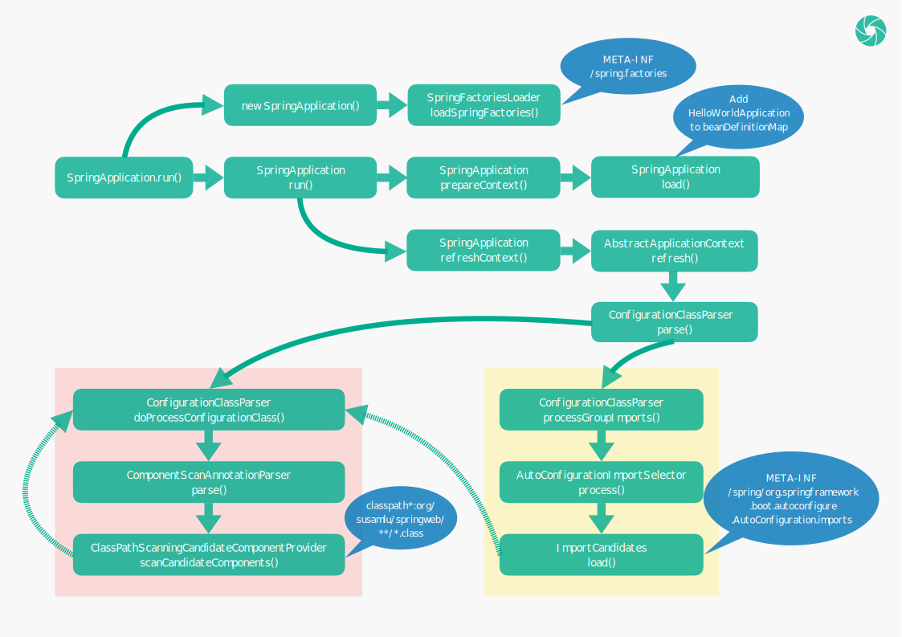

# 从零学习 Spring Web 开发 —— HelloWorld (进阶篇)

上一篇文章已经介绍了如何快速搭建一个 Spring Web 项目，本文将通过分析源码的方式，一步步了解项目是如何运行起来的。

我们前面提到，搭建 Spring Web 项目时，只需要继承 `spring-boot-starter-parent` ，并引入 `spring-boot-starter-web` ，即可把 Spring Web 项目所需要的全部依赖引进来，并且我们不需要指定依赖的版本，这是如何做到的呢？

这里会涉及到 Maven 的 parent 和 dependencyManagement 标签，我们先讲讲这两个标签的作用。

## Maven 标签

### parent

在 Maven 项目中，可以通过继承的方式，让子项目继承父项目所定义的内容，如：groupId、version、properties、dependencies 等。

下面的例子中，`my-app-child` 只需要继承 `my-app-parent` ，即可引入父项目的全部依赖。即父项目 `my-app-parent` 引入了 `maven-artifact` 和 `maven-core` 两个依赖，并指定了它们的版本，子项目只需继承 `my-app-parent` ，就引入了这两个依赖，并且依赖的版本也跟父项目所指定的版本一样。

```xml
<!-- my-app-parent -->
<project xmlns="http://maven.apache.org/POM/4.0.0" xmlns:xsi="http://www.w3.org/2001/XMLSchema-instance"
         xsi:schemaLocation="http://maven.apache.org/POM/4.0.0 http://maven.apache.org/xsd/maven-4.0.0.xsd">
    <modelVersion>4.0.0</modelVersion>

    <groupId>com.mycompany.app</groupId>
    <artifactId>my-app-parent</artifactId>
    <version>1.0-SNAPSHOT</version>

    <name>my-app-parent</name>
    <url>http://www.example.com</url>

    <properties>
        <mavenVersion>3.0</mavenVersion>
    </properties>

    <dependencies>
        <dependency>
            <groupId>org.apache.maven</groupId>
            <artifactId>maven-artifact</artifactId>
            <version>${mavenVersion}</version>
        </dependency>
        <dependency>
            <groupId>org.apache.maven</groupId>
            <artifactId>maven-core</artifactId>
            <version>${mavenVersion}</version>
        </dependency>
    </dependencies>

</project>
```

```xml
<!-- my-app-child -->
<project xmlns="http://maven.apache.org/POM/4.0.0" xmlns:xsi="http://www.w3.org/2001/XMLSchema-instance"
         xsi:schemaLocation="http://maven.apache.org/POM/4.0.0 http://maven.apache.org/xsd/maven-4.0.0.xsd">
    <modelVersion>4.0.0</modelVersion>

    <parent>
        <groupId>com.mycompany.app</groupId>
        <artifactId>my-app-parent</artifactId>
        <version>1.0-SNAPSHOT</version>
    </parent>

    <artifactId>my-app-child</artifactId>

</project>
```

### dependencyManagement

有时候子项目并不需要引入父项目的全部依赖，只需要引入部分依赖，但又希望在父项目中统一定义依赖的版本，`dependencyManagement` 标签可以帮我们完成这个事情。

下面的例子中，`my-app-child` 引入了 `maven-core` 依赖，父项目仅仅只是预定义了依赖的版本。也就是说，父项目指定了 `maven-artifact` 和 `maven-core` 两个依赖的版本，但并没有引入依赖，在子项目中只引入了 `maven-core` 依赖，即 `maven-artifact` 是没有被引入的，且子项目无需指定 `maven-core` 依赖的版本，该依赖的版本就与父项目所指定的版本一样。

```xml
<!-- my-app-parent -->
<project xmlns="http://maven.apache.org/POM/4.0.0" xmlns:xsi="http://www.w3.org/2001/XMLSchema-instance"
         xsi:schemaLocation="http://maven.apache.org/POM/4.0.0 http://maven.apache.org/xsd/maven-4.0.0.xsd">
    <modelVersion>4.0.0</modelVersion>

    <groupId>com.mycompany.app</groupId>
    <artifactId>my-app-parent</artifactId>
    <version>1.0-SNAPSHOT</version>

    <name>my-app-parent</name>
    <url>http://www.example.com</url>

    <properties>
        <mavenVersion>3.0</mavenVersion>
    </properties>

    <dependencyManagement>
        <dependencies>
            <dependency>
                <groupId>org.apache.maven</groupId>
                <artifactId>maven-artifact</artifactId>
                <version>${mavenVersion}</version>
            </dependency>
            <dependency>
                <groupId>org.apache.maven</groupId>
                <artifactId>maven-core</artifactId>
                <version>${mavenVersion}</version>
            </dependency>
        </dependencies>
    </dependencyManagement>

</project>
```

```xml
<!-- my-app-child -->
<project xmlns="http://maven.apache.org/POM/4.0.0" xmlns:xsi="http://www.w3.org/2001/XMLSchema-instance"
         xsi:schemaLocation="http://maven.apache.org/POM/4.0.0 http://maven.apache.org/xsd/maven-4.0.0.xsd">
    <modelVersion>4.0.0</modelVersion>

    <parent>
        <groupId>com.mycompany.app</groupId>
        <artifactId>my-app-parent</artifactId>
        <version>1.0-SNAPSHOT</version>
    </parent>

    <artifactId>my-app-child</artifactId>

    <dependencies>
        <dependency>
            <groupId>org.apache.maven</groupId>
            <artifactId>maven-core</artifactId>
        </dependency>
    </dependencies>

</project>
```

## spring-boot-starter-parent

`spring-boot-starter-parent` 继承自父项目 `spring-boot-dependencies`，`spring-boot-dependencies` 通过 dependencyManagement 标签预先指定了 Spring Boot 项目的全部依赖版本。尤其是，将 `spring-boot-starter-web` 的版本指定为 2.7.2 。

```xml
<!-- spring-boot-starter-parent -->
<project xmlns="http://maven.apache.org/POM/4.0.0"
         xsi:schemaLocation="http://maven.apache.org/POM/4.0.0 http://maven.apache.org/xsd/maven-4.0.0.xsd"
         xmlns:xsi="http://www.w3.org/2001/XMLSchema-instance">
    <modelVersion>4.0.0</modelVersion>
    <parent>
        <groupId>org.springframework.boot</groupId>
        <artifactId>spring-boot-dependencies</artifactId>
        <version>2.7.2</version>
    </parent>
    <!-- ... -->
</project>
```

```xml
<!-- spring-boot-dependencies -->
<project xmlns="http://maven.apache.org/POM/4.0.0"
         xsi:schemaLocation="http://maven.apache.org/POM/4.0.0 http://maven.apache.org/xsd/maven-4.0.0.xsd"
         xmlns:xsi="http://www.w3.org/2001/XMLSchema-instance">
    <modelVersion>4.0.0</modelVersion>
    <groupId>org.springframework.boot</groupId>
    <artifactId>spring-boot-dependencies</artifactId>
    <version>2.7.2</version>
    <packaging>pom</packaging>
    <name>spring-boot-dependencies</name>
    <!-- ... -->
    <dependencyManagement>
        <dependencies>
            <!-- ... -->
            <dependency>
                <groupId>org.springframework.boot</groupId>
                <artifactId>spring-boot-starter-web</artifactId>
                <version>2.7.2</version>
            </dependency>
            <!-- ... -->
        </dependencies>
    </dependencyManagement>
    <!-- ... -->
</project>
```

## spring-boot-starter-web

2.7.2 版本的 `spring-boot-starter-web` 将 `spring-web` 等项目引入了进来，并指定了各依赖的版本：

```xml
<!-- spring-boot-starter-web -->
<project xsi:schemaLocation="http://maven.apache.org/POM/4.0.0 http://maven.apache.org/xsd/maven-4.0.0.xsd"
         xmlns="http://maven.apache.org/POM/4.0.0"
         xmlns:xsi="http://www.w3.org/2001/XMLSchema-instance">
    <modelVersion>4.0.0</modelVersion>
    <groupId>org.springframework.boot</groupId>
    <artifactId>spring-boot-starter-web</artifactId>
    <version>2.7.2</version>
    <name>spring-boot-starter-web</name>
    <!-- ... -->
    <dependencies>
        <dependency>
            <groupId>org.springframework.boot</groupId>
            <artifactId>spring-boot-starter</artifactId>
            <version>2.7.2</version>
            <scope>compile</scope>
        </dependency>
        <dependency>
            <groupId>org.springframework.boot</groupId>
            <artifactId>spring-boot-starter-json</artifactId>
            <version>2.7.2</version>
            <scope>compile</scope>
        </dependency>
        <dependency>
            <groupId>org.springframework.boot</groupId>
            <artifactId>spring-boot-starter-tomcat</artifactId>
            <version>2.7.2</version>
            <scope>compile</scope>
        </dependency>
        <dependency>
            <groupId>org.springframework</groupId>
            <artifactId>spring-web</artifactId>
            <version>5.3.22</version>
            <scope>compile</scope>
        </dependency>
        <dependency>
            <groupId>org.springframework</groupId>
            <artifactId>spring-webmvc</artifactId>
            <version>5.3.22</version>
            <scope>compile</scope>
        </dependency>
    </dependencies>
</project>
```

在 `spring-boot-starter-parent` 和 `spring-boot-starter-web` 的共同作用下，就完成了 Spring Web 项目全部依赖和依赖版本的声明。

> 读到这里，不知道读者有没有这样的疑问：我继承的是 `spring-boot-starter-parent` 项目，为什么却把 `spring-boot-dependencies` 的内容也继承了？这其实是由继承的传递性造成的，即继承的特性导致了子项目除了会继承父项目的内容，同时也会继承所有其它祖先项目的内容。

## @SpringBootApplication 与 SpringApplication

不知道读者在编写 Spring Boot 项目的时候，有没有思考过启动类中为何需要同时使用 @SpringBootApplication 和 SpringApplication，它们分别的作用又是什么？下面让我们一起来一探究竟。

### @SpringBootApplication

@SpringBootApplication 引入了 @SpringBootConfiguration、@EnableAutoConfiguration、@ComponentScan 三个注解：

```java
@SpringBootConfiguration
@EnableAutoConfiguration
@ComponentScan(excludeFilters = { @Filter(type = FilterType.CUSTOM, classes = TypeExcludeFilter.class),
		@Filter(type = FilterType.CUSTOM, classes = AutoConfigurationExcludeFilter.class) })
public @interface SpringBootApplication {
    // ...
}
```

其中 @SpringBootConfiguration 又引入了 @Configuration，从而让 HelloWorldApplication 成为了一个配置类。

```java
@Configuration
@Indexed
public @interface SpringBootConfiguration {
    // ...
}
```

@EnableAutoConfiguration 通过 @Import 引入了 AutoConfigurationImportSelector 类，又通过 @AutoConfigurationPackage 间接地引入了 AutoConfigurationPackages.Registrar 类。

```java
@AutoConfigurationPackage
@Import(AutoConfigurationImportSelector.class)
public @interface EnableAutoConfiguration {
    // ...
}
```

```java
@Import(AutoConfigurationPackages.Registrar.class)
public @interface AutoConfigurationPackage {
    // ...
}
```

总的来说，就是 @SpringBootApplication 通过 @Configuration 注解让启动类 HelloWorldApplication 成为了配置类，通过 @EnableAutoConfiguration 开启了自动配置的扫描，通过 @ComponentScan 开启了 Spring Bean 的自动扫描。

### SpringApplication

SpringApplication.run() 是整个 Spring Boot 应用的入口。其核心的启动流程如下：



#### SpringFactoriesLoader

SpringApplication 的静态 run() 方法，会先创建一个 SpringApplication 实例，再执行它的实例 run() 方法。创建 SpringApplication 的时候，会调用 SpringFactoriesLoader 的 loadSpringFactories() 方法，最终会触发对所有类路径的 jar 包中的 `META-INF/spring.factories` 文件的加载。如在我们的 HelloWorld 项目中，会加载如下几个文件：

```html
jar:file:/Users/susamlu/.m2/repository/org/springframework/boot/spring-boot/2.7.2/spring-boot-2.7.2.jar!/META-INF/spring.factories
jar:file:/Users/susamlu/.m2/repository/org/springframework/boot/spring-boot-autoconfigure/2.7.2/spring-boot-autoconfigure-2.7.2.jar!/META-INF/spring.factories
jar:file:/Users/susamlu/.m2/repository/org/springframework/spring-beans/5.3.22/spring-beans-5.3.22.jar!/META-INF/spring.factories
```

上述 `META-INF/spring.factories` 文件包含的具体内容，在此不作赘述。要了解这些文件的作用，可以通过查看 SpringFactoriesLoader 类的代码和注释进行了解。

SpringFactoriesLoader 类的主要作用是提供 Spring 框架内部一种加载工厂的方式，它可以从多个类路径的 jar 包中的 `META-INF/spring.factories` 文件中加载并实例化给定的工厂。其中，spring.factories 的配置需要遵循 `properties` 配置的格式，并且一般以接口的全限定类名为 key，以具体实现类的全限定类名为 value。例如：

```html
example.MyService=example.MyServiceImpl1,example.MyServiceImpl2
```

SpringFactoriesLoader 提供了 loadFactories()、loadFactoryNames() 两个公共静态方法，一个用于获取工厂实例，一个用于获取工厂类的全限定类名。

#### EnableAutoConfiguration

`META-INF/spring.factories` 还有另一个妙用，就是在此文件中通过定义 EnableAutoConfiguration，让我们自定义的 jar 包中的类也可以成为 Spring Boot 的自动配置类，比如我们定义了如下配置类：

```java
package example;

public class MyAutoConfiguration {
    
    @Bean
    public MyBean() {
        return new MyBean();
    }
    
}
```

则只需要在 resources 目录的 `META-INF/spring.factories` 文件中定义如下配置：

```html
org.springframework.boot.autoconfigure.EnableAutoConfiguration=\
  example.MyAutoConfiguration
```

那么，在我们将该 jar 包引入到项目时，MyAutoConfiguration 类就会被当成自动配置类而被 Spring Boot 自动加载。它的具体的工作原理，将在本章后面的小节中进行解析。

#### prepareContext

SpringApplication 的实例 run() 方法会调用两个非常重要的方法：prepareContext() 和 refreshContext()，这两个方法通过它们的名字就可以大概猜出其的作用了，实际上，一个是用来准备在应用启动前需要预先准备的内容的，一个是用来执行在应用启动时需要执行的核心方法的。

通过代码的追踪，我们会发现 prepareContext() 做了一个比较关键的操作，就是执行了自身实例的 load() 方法，该方法会将 HelloWorldApplication 注册到 Spring 全局的 beanDefinitionMap 中，完成了这一步，后面应用启动时进行自动扫描、自动配置等，就可以找到基类了。

#### refreshContext

refreshContext() 最终会调用 AbstractApplicationContext 的 refresh() 方法，refresh() 经过一系列的复杂调用之后，会将前面被注册到 beanDefinitionMap 的 BeanDefinition：HelloWorldApplication 取出来，并从 HelloWorldApplication 开始，进行配置的解析。

#### doProcessConfigurationClass

配置解析的入口为 ConfigurationClassParser 类的 parse() 方法，parse() 辗转之后，最终会调用到自身实例的 doProcessConfigurationClass() 方法，doProcessConfigurationClass() 是启动阶段当之无愧的核心方法。

```java
class ConfigurationClassParser {
    
    // ...

    protected final SourceClass doProcessConfigurationClass(
            ConfigurationClass configClass, SourceClass sourceClass, Predicate<String> filter)
            throws IOException {

        if (configClass.getMetadata().isAnnotated(Component.class.getName())) {
            // Recursively process any member (nested) classes first （优先递归解析内部类）
            processMemberClasses(configClass, sourceClass, filter);
        }

        // Process any @PropertySource annotations （解析 @PropertySources 注解）
        for (AnnotationAttributes propertySource : AnnotationConfigUtils.attributesForRepeatable(
                sourceClass.getMetadata(), PropertySources.class,
                org.springframework.context.annotation.PropertySource.class)) {
            if (this.environment instanceof ConfigurableEnvironment) {
                processPropertySource(propertySource);
            }
            else {
                logger.info("Ignoring @PropertySource annotation on [" + sourceClass.getMetadata().getClassName() +
                        "]. Reason: Environment must implement ConfigurableEnvironment");
            }
        }

        // Process any @ComponentScan annotations （解析 @ComponentScan 注解）
        Set<AnnotationAttributes> componentScans = AnnotationConfigUtils.attributesForRepeatable(
                sourceClass.getMetadata(), ComponentScans.class, ComponentScan.class);
        if (!componentScans.isEmpty() &&
                !this.conditionEvaluator.shouldSkip(sourceClass.getMetadata(), ConfigurationPhase.REGISTER_BEAN)) {
            for (AnnotationAttributes componentScan : componentScans) {
                // The config class is annotated with @ComponentScan -> perform the scan immediately
                Set<BeanDefinitionHolder> scannedBeanDefinitions =
                        this.componentScanParser.parse(componentScan, sourceClass.getMetadata().getClassName());
                // Check the set of scanned definitions for any further config classes and parse recursively if needed
                for (BeanDefinitionHolder holder : scannedBeanDefinitions) {
                    BeanDefinition bdCand = holder.getBeanDefinition().getOriginatingBeanDefinition();
                    if (bdCand == null) {
                        bdCand = holder.getBeanDefinition();
                    }
                    if (ConfigurationClassUtils.checkConfigurationClassCandidate(bdCand, this.metadataReaderFactory)) {
                        parse(bdCand.getBeanClassName(), holder.getBeanName());
                    }
                }
            }
        }

        // Process any @Import annotations （解析 @Import 注解）
        processImports(configClass, sourceClass, getImports(sourceClass), filter, true);

        // Process any @ImportResource annotations （解析 @ImportResource 注解）
        AnnotationAttributes importResource =
                AnnotationConfigUtils.attributesFor(sourceClass.getMetadata(), ImportResource.class);
        if (importResource != null) {
            String[] resources = importResource.getStringArray("locations");
            Class<? extends BeanDefinitionReader> readerClass = importResource.getClass("reader");
            for (String resource : resources) {
                String resolvedResource = this.environment.resolveRequiredPlaceholders(resource);
                configClass.addImportedResource(resolvedResource, readerClass);
            }
        }

        // Process individual @Bean methods （解析带有 @Bean 注解的方法）
        Set<MethodMetadata> beanMethods = retrieveBeanMethodMetadata(sourceClass);
        for (MethodMetadata methodMetadata : beanMethods) {
            configClass.addBeanMethod(new BeanMethod(methodMetadata, configClass));
        }

        // Process default methods on interfaces （解析父接口的默认方法）
        processInterfaces(configClass, sourceClass);

        // Process superclass, if any （如果存在父类，则解析父类）
        if (sourceClass.getMetadata().hasSuperClass()) {
            String superclass = sourceClass.getMetadata().getSuperClassName();
            if (superclass != null && !superclass.startsWith("java") &&
                    !this.knownSuperclasses.containsKey(superclass)) {
                this.knownSuperclasses.put(superclass, configClass);
                // Superclass found, return its annotation metadata and recurse
                return sourceClass.getSuperClass();
            }
        }

        // No superclass -> processing is complete （不存在父类，则解析完毕）
        return null;
    }
    
    // ...
    
}
```

解析配置类的时候，会进行如下处理：

- 解析内部类
- 解析 @PropertySources 注解
- 解析 @ComponentScan 注解
- 解析 @Import 注解
- 解析 @ImportResource 注解
- 解析带有 @Bean 注解的方法
- 解析父接口的默认方法
- 解析父类

配置类的解析涉及到的内容比较多，这里只对 `解析 @ComponentScan 注解` 这一步进行分析，其他部分后面会有一个专门的专题进行讲解。

#### @ComponentScan

如果配置类带有 @ComponentScan 注解（毫无疑问，HelloWorldApplication 类是带有 @ComponentScan 注解的），就会触发自动扫描，调用 ComponentScanAnnotationParser 类的 parse() 方法。parse() 方法先获取 @ComponentScan 注解指定的 basePackages，如果没有指定，则以当前类所在包的包路径作为 basePackage。接着，再通过 ClassPathScanningCandidateComponentProvider 的 scanCandidateComponents() 方法，扫描 basePackage 下的所有 class 文件，并将符合要求的候选类添加到 beanDefinitionMap 中。如果这个过程中，扫描到了配置类，则又重新回到上面解析配置类的步骤中，不断递归，直到将全部类加载完成。

#### AutoConfigurationImportSelector

自动扫描逻辑执行完毕，调用又重新回到 ConfigurationClassParser 类的 parse() 方法，接着会触发 AutoConfigurationImportSelector 类 process() 方法的执行。process() 方法最终又会触发 ImportCandidates 的 load() 方法，load() 方法会将文件 `META-INF/spring/org.springframework.boot.autoconfigure.AutoConfiguration.imports` 的配置加载到配置类中，从而触发自动配置的解析。

`META-INF/spring/org.springframework.boot.autoconfigure.AutoConfiguration.imports` 文件记录了 Spring Boot 项目中能够被自动加载的全部自动配置类，Spring Boot 执行一定的过滤逻辑后，得到最终需要自动加载的配置类，然后又重新回到 ConfigurationClassParser 类的 doProcessConfigurationClass() 方法，对这些配置类进行逐一解析。配置解析完成之后，整个项目就启动起来了。

`META-INF/spring/org.springframework.boot.autoconfigure.AutoConfiguration.imports` 文件的内容如下，处于文章篇幅的考虑，只列出了少部分内容：

```html
org.springframework.boot.autoconfigure.admin.SpringApplicationAdminJmxAutoConfiguration
org.springframework.boot.autoconfigure.aop.AopAutoConfiguration
org.springframework.boot.autoconfigure.amqp.RabbitAutoConfiguration
......
```

### 启动日志

为了让读者对 Spring Boot 应用的启动过程有更清晰的理解，笔者将结合项目的启动日志，对项目启动的调用流程再次做一次类似但不完全一样的分析。下面是项目的一次启动日志：

```html

  .   ____          _            __ _ _
 /\\ / ___'_ __ _ _(_)_ __  __ _ \ \ \ \
( ( )\___ | '_ | '_| | '_ \/ _` | \ \ \ \
 \\/  ___)| |_)| | | | | || (_| |  ) ) ) )
  '  |____| .__|_| |_|_| |_\__, | / / / /
 =========|_|==============|___/=/_/_/_/
 :: Spring Boot ::                (v2.7.2)

2022-09-08 08:28:22.964  INFO 54995 --- [           main] o.s.springweb.HelloWorldApplication      : Starting HelloWorldApplication using Java 11.0.12 on susamludeMac.local with PID 54995 (/Users/susamlu/code/java/spring-web/spring-web-helloworld/target/classes started by susamlu in /Users/susamlu/code/java/spring-web)
2022-09-08 08:28:22.968  INFO 54995 --- [           main] o.s.springweb.HelloWorldApplication      : No active profile set, falling back to 1 default profile: "default"
2022-09-08 08:28:24.900  INFO 54995 --- [           main] o.s.b.w.embedded.tomcat.TomcatWebServer  : Tomcat initialized with port(s): 8080 (http)
2022-09-08 08:28:24.912  INFO 54995 --- [           main] o.apache.catalina.core.StandardService   : Starting service [Tomcat]
2022-09-08 08:28:24.913  INFO 54995 --- [           main] org.apache.catalina.core.StandardEngine  : Starting Servlet engine: [Apache Tomcat/9.0.65]
2022-09-08 08:28:25.090  INFO 54995 --- [           main] o.a.c.c.C.[Tomcat].[localhost].[/]       : Initializing Spring embedded WebApplicationContext
2022-09-08 08:28:25.091  INFO 54995 --- [           main] w.s.c.ServletWebServerApplicationContext : Root WebApplicationContext: initialization completed in 1910 ms
2022-09-08 08:28:25.857  INFO 54995 --- [           main] o.s.b.w.embedded.tomcat.TomcatWebServer  : Tomcat started on port(s): 8080 (http) with context path ''
2022-09-08 08:28:25.873  INFO 54995 --- [           main] o.s.springweb.HelloWorldApplication      : Started HelloWorldApplication in 3.735 seconds (JVM running for 4.41)
```

SpringApplication 的静态 run() 方法，最终会调用到自身的实例 run() 方法。实例 run() 方法的内容会相对比较复杂，为了简化其中的逻辑，我们重点关注 printBanner()、prepareContext()、refreshContext() 几个方法。

```java
public class SpringApplication {

    // ...

    public ConfigurableApplicationContext run(String... args) {
        // ...
        Banner printedBanner = printBanner(environment);
        // ...
        prepareContext(bootstrapContext, context, environment, listeners, applicationArguments, printedBanner);
        refreshContext(context);
        // ...
    }

    // ...

}
```

#### printBanner

printBanner() 见名知意，是用来打印 Spring Boot 项目的 Banner 的：

```html

  .   ____          _            __ _ _
 /\\ / ___'_ __ _ _(_)_ __  __ _ \ \ \ \
( ( )\___ | '_ | '_| | '_ \/ _` | \ \ \ \
 \\/  ___)| |_)| | | | | || (_| |  ) ) ) )
  '  |____| .__|_| |_|_| |_\__, | / / / /
 =========|_|==============|___/=/_/_/_/
 :: Spring Boot ::                (v2.7.2)

```

SpringApplication 调用 SpringApplicationBannerPrinter 的 print() 方法打印 Banner。

```java
public class SpringApplication {

    // ...

    private Banner printBanner(ConfigurableEnvironment environment) {
        // ...
        SpringApplicationBannerPrinter bannerPrinter = new SpringApplicationBannerPrinter(resourceLoader, this.banner);
        // ...
        return bannerPrinter.print(environment, this.mainApplicationClass, System.out);
    }

    // ...

}
```

SpringApplicationBannerPrinter 优先打印 ImageBanner 或 TextBanner，如果没有设置 ImageBanner 和 TextBanner，则打印 Spring Boot 默认的 Banner。

```java
class SpringApplicationBannerPrinter {

    // ...

    // TextBanner 的文件名
    static final String DEFAULT_BANNER_LOCATION = "banner.txt";

    // ImageBanner 支持的后缀格式
    static final String[] IMAGE_EXTENSION = {"gif", "jpg", "png"};

    private static final Banner DEFAULT_BANNER = new SpringBootBanner();

    // ...

    Banner print(Environment environment, Class<?> sourceClass, PrintStream out) {
        Banner banner = getBanner(environment);
        banner.printBanner(environment, sourceClass, out);
        return new PrintedBanner(banner, sourceClass);
    }

    // ...

    private Banner getBanner(Environment environment) {
        Banners banners = new Banners();
      	// 优先打印 ImageBanner
        banners.addIfNotNull(getImageBanner(environment));
        // 没有设置 ImageBanner，则优先打印 TextBanner
        banners.addIfNotNull(getTextBanner(environment));
        if (banners.hasAtLeastOneBanner()) {
            return banners;
        }
        // ...
        // ImageBanner、TextBanner 都没有设置，则打印 Spring Boot 默认的 Banner
        return DEFAULT_BANNER;
    }

    // ...

}
```

默认的 Banner 值由 SpringBootBanner 类的一个常量值定义：

```java
class SpringBootBanner implements Banner {

    private static final String[] BANNER = {"", "  .   ____          _            __ _ _",
            " /\\\\ / ___'_ __ _ _(_)_ __  __ _ \\ \\ \\ \\", "( ( )\\___ | '_ | '_| | '_ \\/ _` | \\ \\ \\ \\",
            " \\\\/  ___)| |_)| | | | | || (_| |  ) ) ) )", "  '  |____| .__|_| |_|_| |_\\__, | / / / /",
            " =========|_|==============|___/=/_/_/_/"};

    // ...

}
```

如果我们想自定义 Banner，我们可以在项目的 resources 目录下放置 banner.txt 文件，从而改变 Banner 的打印。如我的 banner.txt 文件的内容为：

```html
                     _    __               
    ____   ____ _   (_)  / /_   _____  ___ 
   / __ \ / __ `/  / /  / __/  / ___/ / _ \
  / /_/ // /_/ /  / /  / /_   (__  ) /  __/
 / .___/ \__,_/  /_/   \__/  /____/  \___/ 
/_/                                        
```

程序启动后打印的 Banner 信息被修改为：

```html
                     _    __               
    ____   ____ _   (_)  / /_   _____  ___ 
   / __ \ / __ `/  / /  / __/  / ___/ / _ \
  / /_/ // /_/ /  / /  / /_   (__  ) /  __/
 / .___/ \__,_/  /_/   \__/  /____/  \___/ 
/_/                                        
```

#### prepareContext

prepareContext() 是其中非常重要的一个方法，该方法的作用在上述内容中就所有描述。

```java
public class SpringApplication {

    // ...

    private void prepareContext(/* ... */) {
        // ...
        logStartupInfo(context.getParent() == null);
        logStartupProfileInfo(context);
        // ...
    }

    // ...

}
```

prepareContext() 通过 logStartupInfo()、logStartupProfileInfo() 两个方法，分别输出下面两句日志：

```html
2022-09-08 08:28:22.964  INFO 54995 --- [           main] o.s.springweb.HelloWorldApplication      : Starting HelloWorldApplication using Java 11.0.12 on susamludeMac.local with PID 54995 (/Users/susamlu/code/java/spring-web/spring-web-helloworld/target/classes started by susamlu in /Users/susamlu/code/java/spring-web)
2022-09-08 08:28:22.968  INFO 54995 --- [           main] o.s.springweb.HelloWorldApplication      : No active profile set, falling back to 1 default profile: "default"
```

#### refreshContext

refreshContext() 也是其中的核心方法，Tomcat 的启动就发生在该方法的调用过程中。refreshContext() 最终会调用 AbstractApplicationContext 的 refresh() 方法，refresh() 又调用了自身的 onRefresh() 和 finishRefresh() 方法。

```java
public abstract class AbstractApplicationContext extends DefaultResourceLoader
        implements ConfigurableApplicationContext {

    // ...

    public void refresh() throws BeansException, IllegalStateException {
        // ...
        onRefresh();
        // ...
        finishRefresh();
        // ...
    }

    // ...

}
```

其中 onRefresh() 实际调用的是 ServletWebServerApplicationContext 的 onRefresh() 方法，然后再通过 ServletWebServerFactory 获取 WebServer。

```java
public class ServletWebServerApplicationContext extends GenericWebApplicationContext
        implements ConfigurableWebServerApplicationContext {

    // ...

    protected void onRefresh() {
        // ...
        createWebServer();
        // ...
    }

    // ...

    private void createWebServer() {
        // ...
        ServletWebServerFactory factory = getWebServerFactory();
        // ...
        this.webServer = factory.getWebServer(getSelfInitializer());
        // ...
    }

    // ...

}
```

ServletWebServerFactory 会创建 TomcatWebServer，创建 TomcatWebServer 的时候，它的 initialize() 方法会被自动调用，initialize() 会启动 Tomcat 并输出相关日志。

```java
public class TomcatWebServer implements WebServer {

    // ...

    private void initialize() throws WebServerException {
        logger.info("Tomcat initialized with port(s): " + getPortsDescription(false));
        // ...
        this.tomcat.start();
        // ...
    }

    // ...

}
```

```html
2022-09-08 08:28:24.900  INFO 54995 --- [           main] o.s.b.w.embedded.tomcat.TomcatWebServer  : Tomcat initialized with port(s): 8080 (http)
2022-09-08 08:28:24.912  INFO 54995 --- [           main] o.apache.catalina.core.StandardService   : Starting service [Tomcat]
2022-09-08 08:28:24.913  INFO 54995 --- [           main] org.apache.catalina.core.StandardEngine  : Starting Servlet engine: [Apache Tomcat/9.0.65]
2022-09-08 08:28:25.090  INFO 54995 --- [           main] o.a.c.c.C.[Tomcat].[localhost].[/]       : Initializing Spring embedded WebApplicationContext
2022-09-08 08:28:25.091  INFO 54995 --- [           main] w.s.c.ServletWebServerApplicationContext : Root WebApplicationContext: initialization completed in 1910 ms
```

Tomcat 启动完，onRefresh() 也接着调用完成，再接着 finishRefresh() 会调用 TomcatWebServer 的 start() 方法，输出 Tomcat 启动完成的日志。

```java
public class TomcatWebServer implements WebServer {

    // ...

    public void start() throws WebServerException {
        // ...
        logger.info("Tomcat started on port(s): " + getPortsDescription(true) + " with context path '"
                + getContextPath() + "'");
        // ...
    }

    // ...

}
```

```html
2022-09-08 08:28:25.857  INFO 54995 --- [           main] o.s.b.w.embedded.tomcat.TomcatWebServer  : Tomcat started on port(s): 8080 (http) with context path ''
```

上面的方法都调用完后，最终又回到了 SpringApplication 的 run() 方法，run() 最后输出应用启动完成的日志。

```java
public class SpringApplication {
    
    // ...

    public ConfigurableApplicationContext run(String... args) {
        // ...
        new StartupInfoLogger(this.mainApplicationClass).logStarted(getApplicationLog(), timeTakenToStartup);
        // ...
    }

    // ...
    
}
```

```html
2022-09-08 08:28:25.873  INFO 54995 --- [           main] o.s.springweb.HelloWorldApplication      : Started HelloWorldApplication in 3.735 seconds (JVM running for 4.41)
```

整个流程，可以总结为以下一张图：


[返回首页](https://susamlu.github.io/paitse)
[获取源码](https://github.com/susamlu/spring-web)

