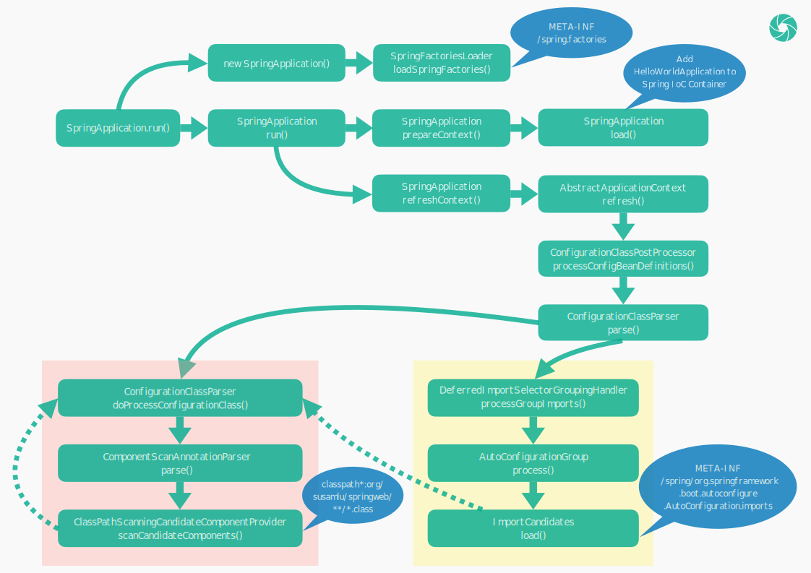

# Spring Web 开发：从入门到精通 —— 应用启动

[TOC]

不知道读者在编写项目的时候，有没有思考过启动类中为何需要同时使用 @SpringBootApplication 和 SpringApplication，它们的作用分别又是什么？下面让我们一起来一探究竟。

## @SpringBootApplication

@SpringBootApplication 引入了 @SpringBootConfiguration、@EnableAutoConfiguration、@ComponentScan 三个注解：

```java
@SpringBootConfiguration
@EnableAutoConfiguration
@ComponentScan(excludeFilters = { @Filter(type = FilterType.CUSTOM, classes = TypeExcludeFilter.class),
		@Filter(type = FilterType.CUSTOM, classes = AutoConfigurationExcludeFilter.class) })
public @interface SpringBootApplication {
    // ...
}
```

其中 @SpringBootConfiguration 又引入了 @Configuration，从而让 HelloWorldApplication 成为了一个配置类。

```java
@Configuration
@Indexed
public @interface SpringBootConfiguration {
    // ...
}
```

@EnableAutoConfiguration 通过 @Import 引入了 AutoConfigurationImportSelector 类，又通过 @AutoConfigurationPackage 间接地引入了 AutoConfigurationPackages.Registrar 类。

```java
@AutoConfigurationPackage
@Import(AutoConfigurationImportSelector.class)
public @interface EnableAutoConfiguration {
    // ...
}
```

```java
@Import(AutoConfigurationPackages.Registrar.class)
public @interface AutoConfigurationPackage {
    // ...
}
```

总的来说，就是 @SpringBootApplication 通过 @Configuration 注解让启动类 HelloWorldApplication 成为了配置类，通过 @EnableAutoConfiguration 开启了自动配置的扫描，通过 @ComponentScan 开启了 Spring bean 的自动扫描。

## SpringApplication

SpringApplication.run() 是整个 Spring 应用的入口。围绕上述提到的注解和类，可以梳理出，其核心的启动流程如下：



### SpringFactoriesLoader

SpringApplication 的静态 run() 方法，会先创建一个 SpringApplication 实例，再执行它的实例 run() 方法。创建 SpringApplication 的时候，会调用 SpringFactoriesLoader 的 loadSpringFactories() 方法，最终会触发对所有类路径的 jar 包中的 `META-INF/spring.factories` 文件的加载。如在我的 HelloWorld 项目中，会加载如下几个文件：

```html
jar:file:/Users/susamlu/.m2/repository/org/springframework/boot/spring-boot/2.7.2/spring-boot-2.7.2.jar!/META-INF/spring.factories
jar:file:/Users/susamlu/.m2/repository/org/springframework/boot/spring-boot-autoconfigure/2.7.2/spring-boot-autoconfigure-2.7.2.jar!/META-INF/spring.factories
jar:file:/Users/susamlu/.m2/repository/org/springframework/spring-beans/5.3.22/spring-beans-5.3.22.jar!/META-INF/spring.factories
```

上述 `META-INF/spring.factories` 文件包含的具体内容，在此不作赘述。要了解这些文件的作用，可以通过查看 SpringFactoriesLoader 类的代码和注释进行了解。

SpringFactoriesLoader 类的主要作用是提供 Spring 框架内部一种加载工厂的方式，它可以从多个类路径的 jar 包中的 `META-INF/spring.factories` 文件中加载并实例化给定的工厂。其中，spring.factories 的配置需要遵循 `properties` 配置的格式，并且一般以接口的全限定类名为 key，以具体实现类的全限定类名为 value。例如：

```html
example.MyService=example.MyServiceImpl1,example.MyServiceImpl2
```

SpringFactoriesLoader 提供了 loadFactories()、loadFactoryNames() 两个公共静态方法，一个用于获取工厂实例，一个用于获取工厂类的全限定类名。因此，`META-INF/spring.factories` 实际上是将一些工厂类（或者是接口的具体实现类）事先配置在文件中，以供应用在需要时获取，通过这种方式，可以绕开获取实例必须从 Spring IoC 容器获取的限制（在全部 Spring bean 加载完成之前，通过这种方式获取实例是很有必要的）。

### EnableAutoConfiguration

`META-INF/spring.factories` 还有另一个妙用，就是在此文件中通过定义 EnableAutoConfiguration，让我们自定义的 jar 包中的类也可以成为 Spring Boot 的自动配置类，比如我们定义了如下配置类：

```java
package example;

public class MyAutoConfiguration {
    
    @Bean
    public MyBean() {
        return new MyBean();
    }
    
}
```

那么，只要在 resources 目录的 `META-INF/spring.factories` 文件中定义如下配置：

```html
org.springframework.boot.autoconfigure.EnableAutoConfiguration=\
  example.MyAutoConfiguration
```

接着，将该项目打包成 jar 包，在我们将该 jar 包引入到某个项目时，MyAutoConfiguration 类就会被当成自动配置类而被 Spring Boot 自动加载。它的具体的工作原理，将在本文后面的小节中进行解析。

### prepareContext

SpringApplication 的实例 run() 方法会调用两个非常重要的方法：prepareContext() 和 refreshContext()，这两个方法通过它们的名字就可以大概猜出其作用了，实际上，一个是用来准备在应用启动前需要预先准备的内容的，一个是用来执行在应用启动时需要执行的核心方法的。

通过代码的追踪，我们会发现 prepareContext() 做了一个比较关键的操作，就是执行了自身实例的 load() 方法，该方法会将 HelloWorldApplication 注册到 Spring IoC 容器中，完成了这一步，后面应用启动时进行自动扫描、自动配置等，就可以找到基类了。

### refreshContext

refreshContext() 最终会调用 AbstractApplicationContext 的 refresh() 方法，refresh() 经过一系列复杂的调用之后，会将前面被注册到 Spring IoC 容器中的 HelloWorldApplication 取出来，并从 HelloWorldApplication 开始，进行配置类的解析。

### doProcessConfigurationClass

配置解析经由 ConfigurationClassPostProcessor 类的 processConfigBeanDefinitions() 方法，调起配置解析的入口： ConfigurationClassParser 类的 parse() 方法，parse() 辗转之后，最终会调用到自身实例的 doProcessConfigurationClass() 方法，doProcessConfigurationClass() 是 Spring bean 加载阶段当之无愧的核心方法。

```java
class ConfigurationClassParser {
    
    // ...

    protected final SourceClass doProcessConfigurationClass(
            ConfigurationClass configClass, SourceClass sourceClass, Predicate<String> filter)
            throws IOException {

        if (configClass.getMetadata().isAnnotated(Component.class.getName())) {
            // Recursively process any member (nested) classes first （优先递归解析内部类）
            processMemberClasses(configClass, sourceClass, filter);
        }

        // Process any @PropertySource annotations （解析 @PropertySources 注解）
        for (AnnotationAttributes propertySource : AnnotationConfigUtils.attributesForRepeatable(
                sourceClass.getMetadata(), PropertySources.class,
                org.springframework.context.annotation.PropertySource.class)) {
            // ...
        }

        // Process any @ComponentScan annotations （解析 @ComponentScan 注解）
        Set<AnnotationAttributes> componentScans = AnnotationConfigUtils.attributesForRepeatable(
                sourceClass.getMetadata(), ComponentScans.class, ComponentScan.class);
        if (!componentScans.isEmpty() &&
                !this.conditionEvaluator.shouldSkip(sourceClass.getMetadata(), ConfigurationPhase.REGISTER_BEAN)) {
            // ...
        }

        // Process any @Import annotations （解析 @Import 注解）
        processImports(configClass, sourceClass, getImports(sourceClass), filter, true);

        // Process any @ImportResource annotations （解析 @ImportResource 注解）
        AnnotationAttributes importResource =
                AnnotationConfigUtils.attributesFor(sourceClass.getMetadata(), ImportResource.class);
        if (importResource != null) {
            // ...
        }

        // Process individual @Bean methods （解析带有 @Bean 注解的方法）
        Set<MethodMetadata> beanMethods = retrieveBeanMethodMetadata(sourceClass);
        for (MethodMetadata methodMetadata : beanMethods) {
            configClass.addBeanMethod(new BeanMethod(methodMetadata, configClass));
        }

        // Process default methods on interfaces （解析父接口的默认方法）
        processInterfaces(configClass, sourceClass);

        // Process superclass, if any （如果存在父类，则解析父类）
        if (sourceClass.getMetadata().hasSuperClass()) {
            // ...
        }

        // No superclass -> processing is complete （不存在父类，则解析完毕）
        return null;
    }
    
    // ...
    
}
```

解析配置类的时候，会进行如下处理：

- 解析内部类
- 解析 @PropertySources 注解
- 解析 @ComponentScan 注解
- 解析 @Import 注解
- 解析 @ImportResource 注解
- 解析带有 @Bean 注解的方法
- 解析父接口的默认方法
- 解析父类

配置类的解析涉及到的内容比较多，这里只对 `解析 @ComponentScan 注解` 这一步进行分析，其他部分后面会有一篇单独的文章进行讲解。

### ComponentScan

如果配置类带有 @ComponentScan 注解（毫无疑问，HelloWorldApplication 类是带有 @ComponentScan 注解的），就会触发自动扫描，调用 ComponentScanAnnotationParser 类的 parse() 方法。

parse() 方法会创建一个 ClassPathBeanDefinitionScanner 实例，并设置 scanner 的 includeFilters 和 excludeFilters：

```java
class ComponentScanAnnotationParser {
    
    // ...

    public Set<BeanDefinitionHolder> parse(AnnotationAttributes componentScan, String declaringClass) {
        ClassPathBeanDefinitionScanner scanner = new ClassPathBeanDefinitionScanner(this.registry,
                componentScan.getBoolean("useDefaultFilters"), this.environment, this.resourceLoader);

        // ...

        for (AnnotationAttributes includeFilterAttributes : componentScan.getAnnotationArray("includeFilters")) {
            List<TypeFilter> typeFilters = TypeFilterUtils.createTypeFiltersFor(includeFilterAttributes, this.environment,
                    this.resourceLoader, this.registry);
            for (TypeFilter typeFilter : typeFilters) {
                scanner.addIncludeFilter(typeFilter);
            }
        }
        for (AnnotationAttributes excludeFilterAttributes : componentScan.getAnnotationArray("excludeFilters")) {
            List<TypeFilter> typeFilters = TypeFilterUtils.createTypeFiltersFor(excludeFilterAttributes, this.environment,
                    this.resourceLoader, this.registry);
            for (TypeFilter typeFilter : typeFilters) {
                scanner.addExcludeFilter(typeFilter);
            }
        }

        // ...

        scanner.addExcludeFilter(new AbstractTypeHierarchyTraversingFilter(false, false) {
            @Override
            protected boolean matchClassName(String className) {
                return declaringClass.equals(className);
            }
        });
        return scanner.doScan(StringUtils.toStringArray(basePackages));
    }
    
    // ...
    
}
```

filter 的设置策略取决于 @ComponentScan 注解，@ComponentScan 注解的 useDefaultFilters 属性默认为 true，因此默认会采用 Spring 框架默认定义的 filter，最终得到两个 includeFilter，这两个 includeFilter 都是 AnnotationTypeFilter，其中一个的 annotationType 为 org.springframework.stereotype.Component，另一个的 annotationType 为 javax.annotation.ManagedBean。接着，会将 @ComponentScan 注解指定的 includeFilters 和 excludeFilters 添加到 scanner 中，由上文可知，@ComponentScan 设置了两个 excludeFilters：TypeExcludeFilter 和 AutoConfigurationExcludeFilter，即 TypeExcludeFilter 和 AutoConfigurationExcludeFilter 都会被加入到 scanner 的 excludeFilters 中。最后，再将自定义的 excludeFilter：匿名 AbstractTypeHierarchyTraversingFilter 添加到 scanner 的 excludeFilters 中。最终，scanner 会得到 2 个 includeFilter 和 3 个 excludeFilter。即：

- includeFilters：
  - AnnotationTypeFilter(org.springframework.stereotype.Component)
  - AnnotationTypeFilter(javax.annotation.ManagedBean)
- excludeFilters：
  - TypeExcludeFilter
  - AutoConfigurationExcludeFilter
  - AbstractTypeHierarchyTraversingFilter

其中，AnnotationTypeFilter 的作用是过滤包含有指定注解的类，两个 AnnotationTypeFilter 都是 includeFilter，因此，只要类包含 @Component 或 @ManagedBean 注解，就会被扫描到。TypeExcludeFilter 主要是预留于扩展之用，即通过 TypeExcludeFilter 可以自定义排除扫描的规则，AutoConfigurationExcludeFilter 主要用于排除对自动配置类的扫描，自定义的匿名 AbstractTypeHierarchyTraversingFilter 主要是用来排除扫描的基类（即 HelloWorldApplication），以避免扫描陷入死循环之中。因此，总的来说，默认情况下，@ComponentScan 注解的解析过程中，会将基类和自动配置类排除，将包含有 @Component 注解的类扫描并添加到 Spring IoC 容器中。

另外，parse() 方法会获取 @ComponentScan 注解指定的 basePackages，如果没有指定，则以当前类所在包的包路径作为 basePackage。接着，再通过 ClassPathScanningCandidateComponentProvider 的 scanCandidateComponents() 方法，扫描 basePackage 下的所有 class 文件，并将符合要求（通过 scanner 的 includeFilters 和 excludeFilters 进行筛选）的候选类添加到 Spring IoC 容器中。如果这个过程中，扫描到了配置类，则又重新回到上面解析配置类的步骤中，不断递归，直到将全部类加载完成。

### AutoConfigurationImportSelector

自动扫描逻辑执行完毕，调用又重新回到 ConfigurationClassParser 类的 parse() 方法，接着会触发 AutoConfigurationImportSelector 的内部类 AutoConfigurationGroup 的 process() 方法的执行。process() 方法会将全部自动配置类加载到内存中，并按照一定规则进行筛选。其中，加载的核心代码如下：

```java
public class AutoConfigurationImportSelector /* ... */ {
    
    // ...

    private static class AutoConfigurationGroup /* ... */ {

        protected List<String> getCandidateConfigurations(AnnotationMetadata metadata, AnnotationAttributes attributes) {
            List<String> configurations = new ArrayList<>(
                    SpringFactoriesLoader.loadFactoryNames(getSpringFactoriesLoaderFactoryClass(), getBeanClassLoader()));
            ImportCandidates.load(AutoConfiguration.class, getBeanClassLoader()).forEach(configurations::add);
            Assert.notEmpty(configurations,
                    "No auto configuration classes found in META-INF/spring.factories nor in META-INF/spring/org.springframework.boot.autoconfigure.AutoConfiguration.imports. If you "
                            + "are using a custom packaging, make sure that file is correct.");
            return configurations;
        }

        // ...

        protected Class<?> getSpringFactoriesLoaderFactoryClass() {
            return EnableAutoConfiguration.class;
        }

        // ...

    }

    // ...
    
}
```

加载的内容包含两部分，一部分是从 `META-INF/spring.factories` 加载来的，一部分是从 `META-INF/spring/org.springframework.boot.autoconfigure.AutoConfiguration.imports` 加载来的。从 `META-INF/spring.factories` 加载的，正是 key 为 EnableAutoConfiguration 的配置类，这就是上述所讲的 EnableAutoConfiguration 为何起作用的原因。而文件 `META-INF/spring/org.springframework.boot.autoconfigure.AutoConfiguration.imports` 记录的是 Spring Boot 全部的自动配置类。加载阶段获取到的配置类，还需要经过一定规则的筛选，最终筛选出来的配置类，才会被真正解析。

`spring-boot-2.7.2.jar` 的 `META-INF/spring.factories` 文件中定义了如下几个 filter，自动配置类正是根据这几个 filter 进行过滤的。

```html
# Auto Configuration Import Filters
org.springframework.boot.autoconfigure.AutoConfigurationImportFilter=\
org.springframework.boot.autoconfigure.condition.OnBeanCondition,\
org.springframework.boot.autoconfigure.condition.OnClassCondition,\
org.springframework.boot.autoconfigure.condition.OnWebApplicationCondition
```

这三个类分别对应注解：@ConditionalOnBean、@ConditionalOnClass、@ConditionalOnWebApplication。其中，@ConditionalOnBean 表示当 Spring 容器中存在某个 bean 时，配置类才会生效，它通常会跟 @ConditionalOnSingleCandidate 注解一起起作用，@ConditionalOnSingleCandidate 的作用是表示容器中的 bean 为单例时，配置类才起作用。@ConditionalOnClass 表示配置类在应用中存在某个指定的类时才生效。@ConditionalOnWebApplication 表示项目是 web 项目时，配置类才生效，它有一个 type 参数，可以指定当项目是基于 servlet 的项目（type=SERVLET）或者是基于 reactive 的项目（type=REACTIVE）时才生效，默认为只要是其中一种项目就生效。

通过层层筛选后，最终得到的自动配置类，就会被当做配置类通过 doProcessConfigurationClass() 方法逐个进行解析。

到了这里，我们对 Spring Boot 项目是如何启动的，就有了一个基本的认识，我们回忆下前文提到的几个注解： @Configuration、@EnableAutoConfiguration、@ComponentScan，以及 import 进来的类：AutoConfigurationImportSelector、AutoConfigurationPackages.Registrar，除了 AutoConfigurationPackages.Registrar，上文中都已经有相关的解析了，而 AutoConfigurationPackages.Registrar 又是用来做什么的呢？在了解完相关的代码之后，可以从这个类的注释中得到答案：它主要是用于记录自动配置类的包路径的，以便于后面有需要的时候使用，如 JPA 的实体扫描等。

自动配置类解析完成之后，还有一个问题尚未谈及，即自动配置类自身是在什么时候被加载到 Spring IoC 容器中的。其实，当自动扫描和自动配置的逻辑执行完之后，方法调用又重新回到了 ConfigurationClassPostProcessor 类的 processConfigBeanDefinitions() 方法，该方法会将自动配置类统一加载到 Spring IoC 容器中，至此，所有的 bean 就加载完成了。

## 小结

聊了那么多之后，让我们回到文章开始提到的问题：启动类中为何需要同时使用 @SpringBootApplication 和 SpringApplication，它们的作用分别又是什么？

显然，SpringApplication.run() 作为整个 Spring 应用的入口，是必须要执行的，否则接下来的一系列操作都无从执行。因此，SpringApplication 是必不可少的，而 @SpringBootApplication 呢？为了验证 @SpringBootApplication 是否也是必须的，我们可以做一些实验。我们可以将启动类的 @SpringBootApplication 注解去掉，然后启动应用，看看这是否是可行的。事实上，应用会启动失败，并且我们会得到下面这个错误提示：

```html
Web application could not be started as there was no org.springframework.boot.web.servlet.server.ServletWebServerFactory bean defined in the context.
```

这其实是由于自动配置没有加载而导致的，于是我们给启动类加上 @EnableAutoConfiguration 注解，再启动应用，会发现应用可以启动了。（为什么会这样？其实是由于 @EnableAutoConfiguration 对 AutoConfigurationImportSelector 的引入导致的，如果应用没有引入 AutoConfigurationImportSelector 类，就不会触发在其中定义的一系列的自动配置解析逻辑。）但是这个时候，我们会发现接口访问不了了，于是接着给启动类加上 @ComponentScan 注解，再次启动应用，接口就可以正常访问了。这时候似乎一切都正常了：应用可以正常启动，接口可以正常访问。我们会发现，没有 @Configuration 注解似乎也是可行的。有没有 @Configuration 的区别是什么呢？这里我们先不回答，等我们了解完 Spring 配置类的特性后，相信这个问题也会迎刃而解。

最后，我们再总结一下：@SpringBootApplication 和 SpringApplication 在启动类中都是必须的，@SpringBootApplication 标识了应用需要进行自动配置类和 Spring bean 的自动加载，SpringApplication.run() 作为应用的最初入口，它们在应用的启动过程中，相互起作用，缺一不可。

[返回首页](https://susamlu.github.io/paitse)
[获取源码](https://github.com/susamlu/spring-web)