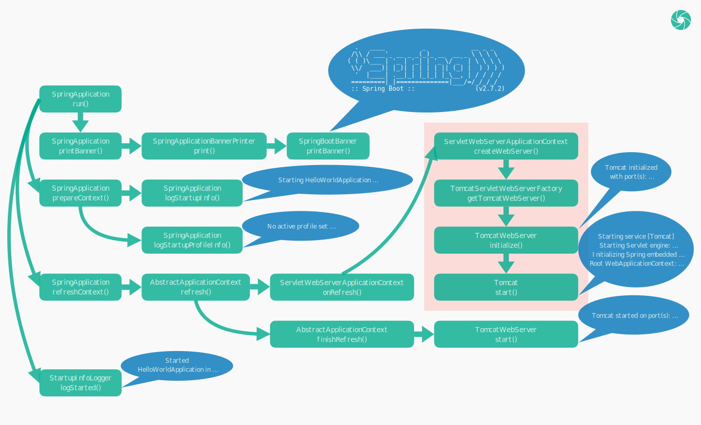

# Spring Web 开发：从入门到精通 —— 启动日志

[TOC]

上一篇文章中，我们紧紧围绕 @SpringBootApplication 引入的注解和类，对 Spring Boot 项目的启动过程做了一次分析。在实际的开发过程中，项目的代码毫无疑问是与我们最为相关的，另外，我们也不可忽视项目日志在我们日常开发中所起的作用。因此，本文将围绕项目的启动日志，对项目的启动过程再做一次分析，以便于我们更好地理解整个项目的运行逻辑。本系列文章中，笔者将会使用较多的笔墨展示代码与日志的相互关联，希望通过这样的方式，可以慢慢让读者培养起一种代码与日志彼此贯穿的思路，以帮助读者在实际开发过程中，更好地解决所遇到的问题。

下面是项目的一次启动日志：

```html

  .   ____          _            __ _ _
 /\\ / ___'_ __ _ _(_)_ __  __ _ \ \ \ \
( ( )\___ | '_ | '_| | '_ \/ _` | \ \ \ \
 \\/  ___)| |_)| | | | | || (_| |  ) ) ) )
  '  |____| .__|_| |_|_| |_\__, | / / / /
 =========|_|==============|___/=/_/_/_/
 :: Spring Boot ::                (v2.7.2)

2022-09-08 08:28:22.964  INFO 54995 --- [           main] o.s.springweb.HelloWorldApplication      : Starting HelloWorldApplication using Java 11.0.12 on susamludeMac.local with PID 54995 (/Users/susamlu/code/java/spring-web/spring-web-helloworld/target/classes started by susamlu in /Users/susamlu/code/java/spring-web)
2022-09-08 08:28:22.968  INFO 54995 --- [           main] o.s.springweb.HelloWorldApplication      : No active profile set, falling back to 1 default profile: "default"
2022-09-08 08:28:24.900  INFO 54995 --- [           main] o.s.b.w.embedded.tomcat.TomcatWebServer  : Tomcat initialized with port(s): 8080 (http)
2022-09-08 08:28:24.912  INFO 54995 --- [           main] o.apache.catalina.core.StandardService   : Starting service [Tomcat]
2022-09-08 08:28:24.913  INFO 54995 --- [           main] org.apache.catalina.core.StandardEngine  : Starting Servlet engine: [Apache Tomcat/9.0.65]
2022-09-08 08:28:25.090  INFO 54995 --- [           main] o.a.c.c.C.[Tomcat].[localhost].[/]       : Initializing Spring embedded WebApplicationContext
2022-09-08 08:28:25.091  INFO 54995 --- [           main] w.s.c.ServletWebServerApplicationContext : Root WebApplicationContext: initialization completed in 1910 ms
2022-09-08 08:28:25.857  INFO 54995 --- [           main] o.s.b.w.embedded.tomcat.TomcatWebServer  : Tomcat started on port(s): 8080 (http) with context path ''
2022-09-08 08:28:25.873  INFO 54995 --- [           main] o.s.springweb.HelloWorldApplication      : Started HelloWorldApplication in 3.735 seconds (JVM running for 4.41)
```

SpringApplication 的静态 run() 方法，最终会调用到自身的实例 run() 方法。实例 run() 方法的内容会相对比较复杂，为了简化其中的逻辑，我们重点关注 printBanner()、prepareContext()、refreshContext() 几个方法。

```java
public class SpringApplication {

    // ...

    public ConfigurableApplicationContext run(String... args) {
        // ...
        Banner printedBanner = printBanner(environment);
        // ...
        prepareContext(bootstrapContext, context, environment, listeners, applicationArguments, printedBanner);
        refreshContext(context);
        // ...
    }

    // ...

}
```

## printBanner

printBanner() 见名知意，是用来打印 Spring Boot 项目的 Banner 的：

```html

  .   ____          _            __ _ _
 /\\ / ___'_ __ _ _(_)_ __  __ _ \ \ \ \
( ( )\___ | '_ | '_| | '_ \/ _` | \ \ \ \
 \\/  ___)| |_)| | | | | || (_| |  ) ) ) )
  '  |____| .__|_| |_|_| |_\__, | / / / /
 =========|_|==============|___/=/_/_/_/
 :: Spring Boot ::                (v2.7.2)

```

SpringApplication 调用 SpringApplicationBannerPrinter 的 print() 方法打印 Banner。

```java
public class SpringApplication {

    // ...

    private Banner printBanner(ConfigurableEnvironment environment) {
        // ...
        SpringApplicationBannerPrinter bannerPrinter = new SpringApplicationBannerPrinter(resourceLoader, this.banner);
        // ...
        return bannerPrinter.print(environment, this.mainApplicationClass, System.out);
    }

    // ...

}
```

SpringApplicationBannerPrinter 优先打印 ImageBanner 或 TextBanner，如果没有设置 ImageBanner 和 TextBanner，则打印 Spring Boot 默认的 Banner。

```java
class SpringApplicationBannerPrinter {

    // ...

    // TextBanner 的文件名
    static final String DEFAULT_BANNER_LOCATION = "banner.txt";

    // ImageBanner 支持的后缀格式
    static final String[] IMAGE_EXTENSION = {"gif", "jpg", "png"};

    // 默认的 Banner
    private static final Banner DEFAULT_BANNER = new SpringBootBanner();

    // ...

    Banner print(Environment environment, Class<?> sourceClass, PrintStream out) {
        Banner banner = getBanner(environment);
        banner.printBanner(environment, sourceClass, out);
        return new PrintedBanner(banner, sourceClass);
    }

    // ...

    private Banner getBanner(Environment environment) {
        Banners banners = new Banners();
      	// 优先打印 ImageBanner
        banners.addIfNotNull(getImageBanner(environment));
        // 没有设置 ImageBanner，则优先打印 TextBanner
        banners.addIfNotNull(getTextBanner(environment));
        if (banners.hasAtLeastOneBanner()) {
            return banners;
        }
        // ...
        // ImageBanner、TextBanner 都没有设置，则打印 Spring Boot 默认的 Banner
        return DEFAULT_BANNER;
    }

    // ...

}
```

默认的 Banner 值的主要内容由 SpringBootBanner 类的一个常量值定义：

```java
class SpringBootBanner implements Banner {

    private static final String[] BANNER = {"", "  .   ____          _            __ _ _",
            " /\\\\ / ___'_ __ _ _(_)_ __  __ _ \\ \\ \\ \\", "( ( )\\___ | '_ | '_| | '_ \\/ _` | \\ \\ \\ \\",
            " \\\\/  ___)| |_)| | | | | || (_| |  ) ) ) )", "  '  |____| .__|_| |_|_| |_\\__, | / / / /",
            " =========|_|==============|___/=/_/_/_/"};

    // ...

}
```

如果我们想自定义 Banner，我们可以在项目的 resources 目录下放置 banner.txt 文件，从而改变 Banner 的打印。如我的 banner.txt 文件的内容为：

```html
                     _    __               
    ____   ____ _   (_)  / /_   _____  ___ 
   / __ \ / __ `/  / /  / __/  / ___/ / _ \
  / /_/ // /_/ /  / /  / /_   (__  ) /  __/
 / .___/ \__,_/  /_/   \__/  /____/  \___/ 
/_/                                        
```

程序启动后打印的 Banner 信息被修改为：

```html
                     _    __               
    ____   ____ _   (_)  / /_   _____  ___ 
   / __ \ / __ `/  / /  / __/  / ___/ / _ \
  / /_/ // /_/ /  / /  / /_   (__  ) /  __/
 / .___/ \__,_/  /_/   \__/  /____/  \___/ 
/_/                                        
```

## prepareContext

prepareContext() 是其中非常重要的一个方法，该方法的作用在上一篇文章中就所有提及。

```java
public class SpringApplication {

    // ...

    private void prepareContext(/* ... */) {
        // ...
        logStartupInfo(context.getParent() == null);
        logStartupProfileInfo(context);
        // ...
    }

    // ...

}
```

prepareContext() 通过 logStartupInfo()、logStartupProfileInfo() 两个方法，分别输出下面两句日志：

```html
2022-09-08 08:28:22.964  INFO 54995 --- [           main] o.s.springweb.HelloWorldApplication      : Starting HelloWorldApplication using Java 11.0.12 on susamludeMac.local with PID 54995 (/Users/susamlu/code/java/spring-web/spring-web-helloworld/target/classes started by susamlu in /Users/susamlu/code/java/spring-web)
2022-09-08 08:28:22.968  INFO 54995 --- [           main] o.s.springweb.HelloWorldApplication      : No active profile set, falling back to 1 default profile: "default"
```

## refreshContext

refreshContext() 也是其中的核心方法，Tomcat 的启动就发生在该方法的调用过程中。refreshContext() 最终会调用 AbstractApplicationContext 的 refresh() 方法，refresh() 又调用了自身的 onRefresh() 和 finishRefresh() 方法。

```java
public abstract class AbstractApplicationContext extends DefaultResourceLoader
        implements ConfigurableApplicationContext {

    // ...

    public void refresh() throws BeansException, IllegalStateException {
        // ...
        onRefresh();
        // ...
        finishRefresh();
        // ...
    }

    // ...

}
```

其中 onRefresh() 实际调用的是 ServletWebServerApplicationContext 的 onRefresh() 方法，然后再通过 ServletWebServerFactory 获取 WebServer。

```java
public class ServletWebServerApplicationContext extends GenericWebApplicationContext
        implements ConfigurableWebServerApplicationContext {

    // ...

    protected void onRefresh() {
        // ...
        createWebServer();
        // ...
    }

    // ...

    private void createWebServer() {
        // ...
        ServletWebServerFactory factory = getWebServerFactory();
        // ...
        this.webServer = factory.getWebServer(getSelfInitializer());
        // ...
    }

    // ...

}
```

ServletWebServerFactory 会创建 TomcatWebServer，创建 TomcatWebServer 的时候，它的 initialize() 方法会被自动调用，initialize() 会启动 Tomcat 并输出相关日志。

```java
public class TomcatWebServer implements WebServer {

    // ...

    private void initialize() throws WebServerException {
        logger.info("Tomcat initialized with port(s): " + getPortsDescription(false));
        // ...
        this.tomcat.start();
        // ...
    }

    // ...

}
```

```html
2022-09-08 08:28:24.900  INFO 54995 --- [           main] o.s.b.w.embedded.tomcat.TomcatWebServer  : Tomcat initialized with port(s): 8080 (http)
2022-09-08 08:28:24.912  INFO 54995 --- [           main] o.apache.catalina.core.StandardService   : Starting service [Tomcat]
2022-09-08 08:28:24.913  INFO 54995 --- [           main] org.apache.catalina.core.StandardEngine  : Starting Servlet engine: [Apache Tomcat/9.0.65]
2022-09-08 08:28:25.090  INFO 54995 --- [           main] o.a.c.c.C.[Tomcat].[localhost].[/]       : Initializing Spring embedded WebApplicationContext
2022-09-08 08:28:25.091  INFO 54995 --- [           main] w.s.c.ServletWebServerApplicationContext : Root WebApplicationContext: initialization completed in 1910 ms
```

Tomcat 启动完，onRefresh() 也接着调用完成，再接着 finishRefresh() 会调用 TomcatWebServer 的 start() 方法，输出 Tomcat 启动完成的日志。

```java
public class TomcatWebServer implements WebServer {

    // ...

    public void start() throws WebServerException {
        // ...
        logger.info("Tomcat started on port(s): " + getPortsDescription(true) + " with context path '"
                + getContextPath() + "'");
        // ...
    }

    // ...

}
```

```html
2022-09-08 08:28:25.857  INFO 54995 --- [           main] o.s.b.w.embedded.tomcat.TomcatWebServer  : Tomcat started on port(s): 8080 (http) with context path ''
```

上面的方法都调用完后，最终又回到了 SpringApplication 的 run() 方法，run() 最后输出应用启动完成的日志。

```java
public class SpringApplication {
    
    // ...

    public ConfigurableApplicationContext run(String... args) {
        // ...
        new StartupInfoLogger(this.mainApplicationClass).logStarted(getApplicationLog(), timeTakenToStartup);
        // ...
    }

    // ...
    
}
```

```html
2022-09-08 08:28:25.873  INFO 54995 --- [           main] o.s.springweb.HelloWorldApplication      : Started HelloWorldApplication in 3.735 seconds (JVM running for 4.41)
```

整个流程，可以总结为以下一张图：



[返回首页](https://susamlu.github.io/paitse)
[获取源码](https://github.com/susamlu/spring-web)